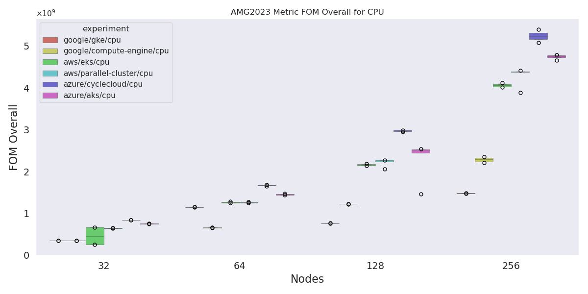
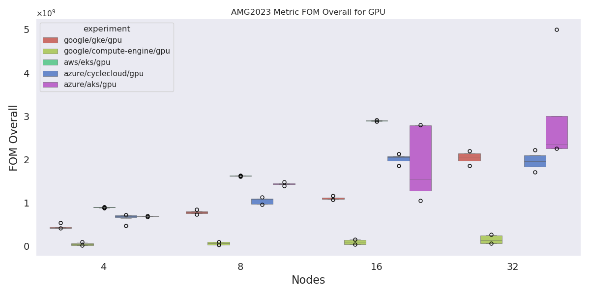
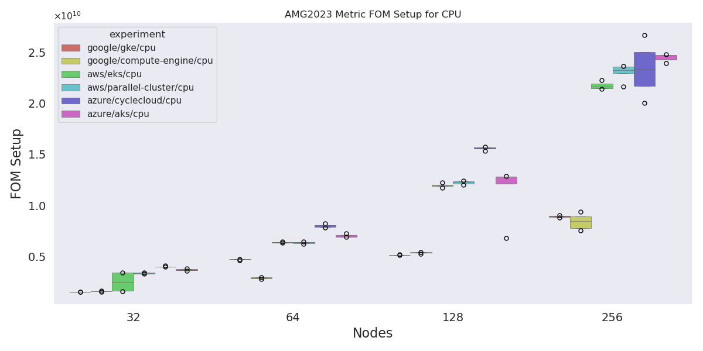
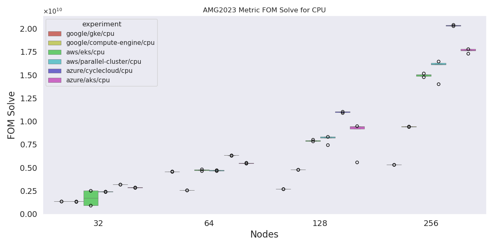
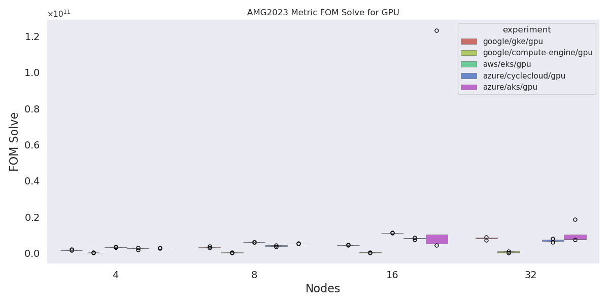
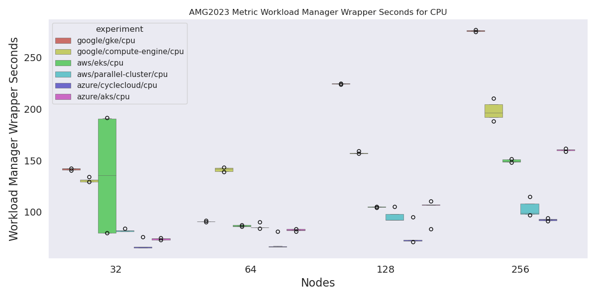
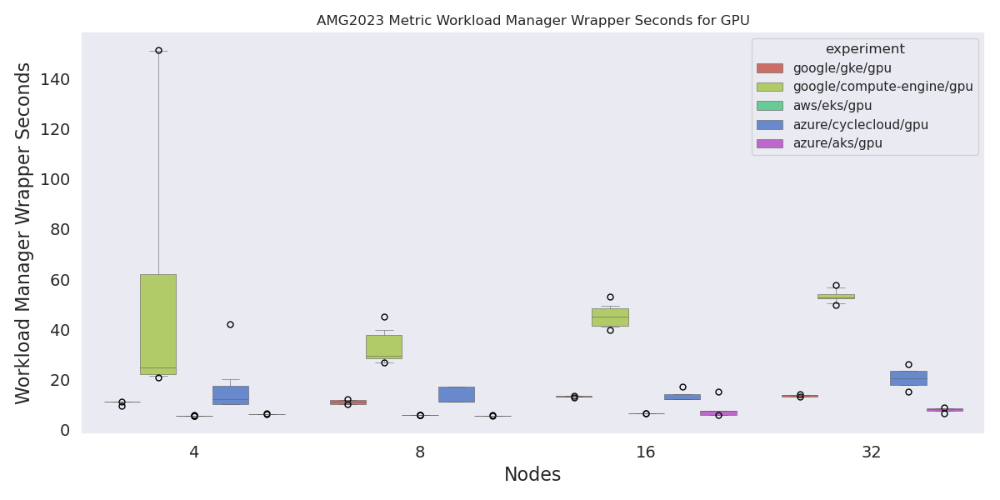

# AMG2023 Analysis

For this benchmark we are primarily interested in the FOM (figure of merit) at the bottom so that is what I'll parse and plot. You need:

```bash
pip install -r requirements.txt
```

Then:

```bash
python 1-run-analysis.py

# Add on premises data (for local only)
python 1-run-analysis.py --on-premises
```

Note that the [1-run-analysis.py](1-run-analysis.py) has a listing of erroneous runs at the top that can be further investigated, most on CycleCloud. I was conservative to not remove extra runs - including runs that were done without the shared memory fix or a placement group or efa (and later redone). We can adjust these for paper figures, but I'm leaving now out of interest for what it looks like.

## Results

### FOM Overall

> Figure of Merit (FOM): nnz_AP / (Setup Phase Time + 3 * Solve Phase Time)

#### FOM Overall CPU



#### FOM Overall GPU



### FOM Setup

> FOM_Setup: nnz_AP / Setup Phase Time

#### FOM Setup CPU



#### FOM Setup GPU


### FOM Solve

> FOM_Solve: nnz_AP * iterations / Solve Phase Time

#### FOM Solve CPU



#### FOM Solve GPU



### Wall Time

> seconds

For slurm this is the job wrapping time, and for flux it is shell.start to done

#### Wall Time CPU



#### Wall Time GPU



