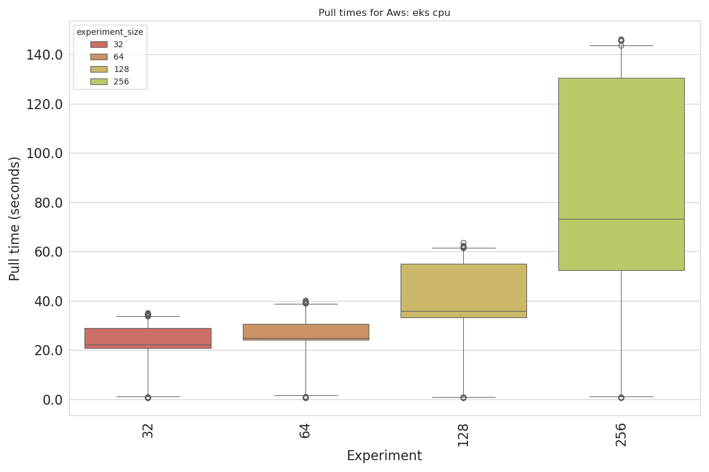
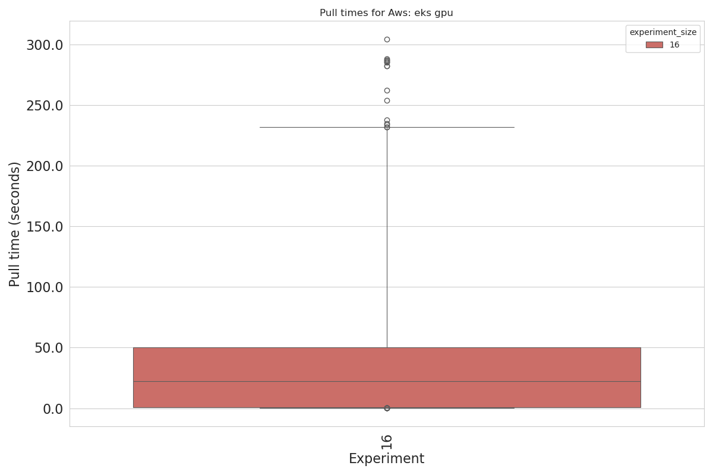
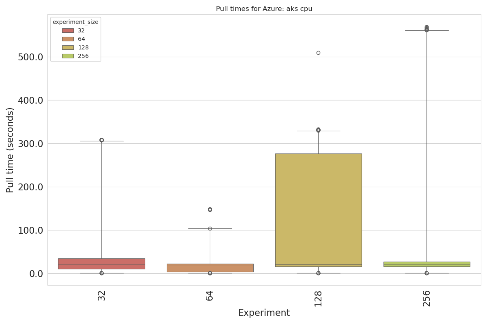
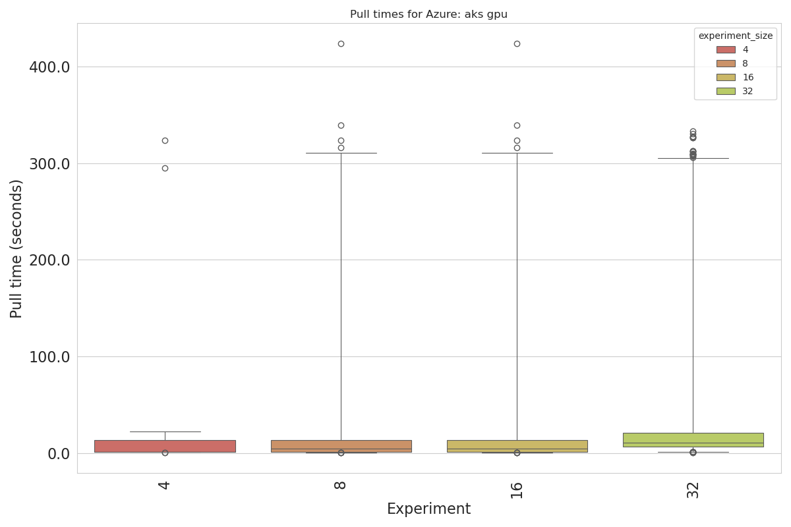
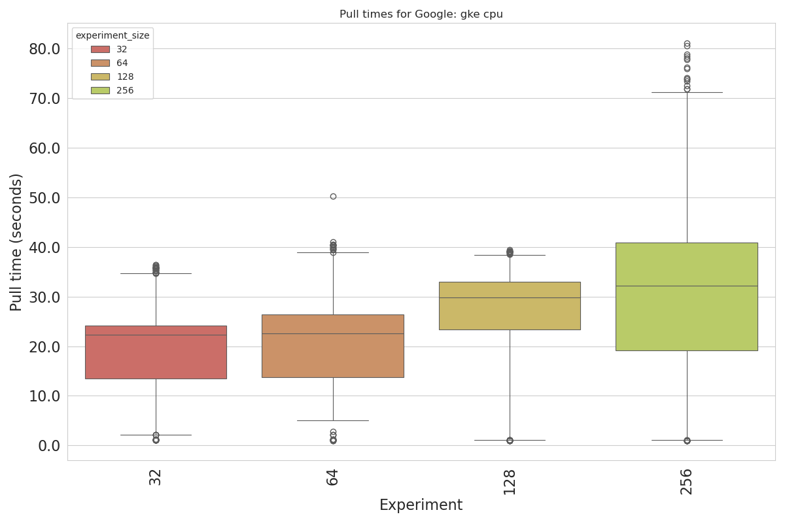
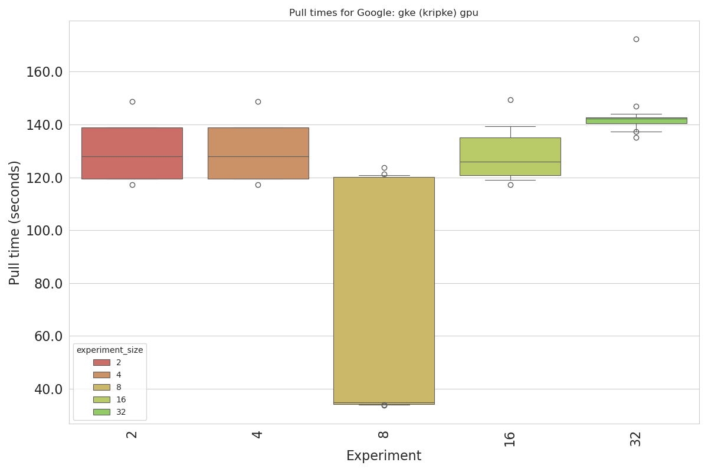
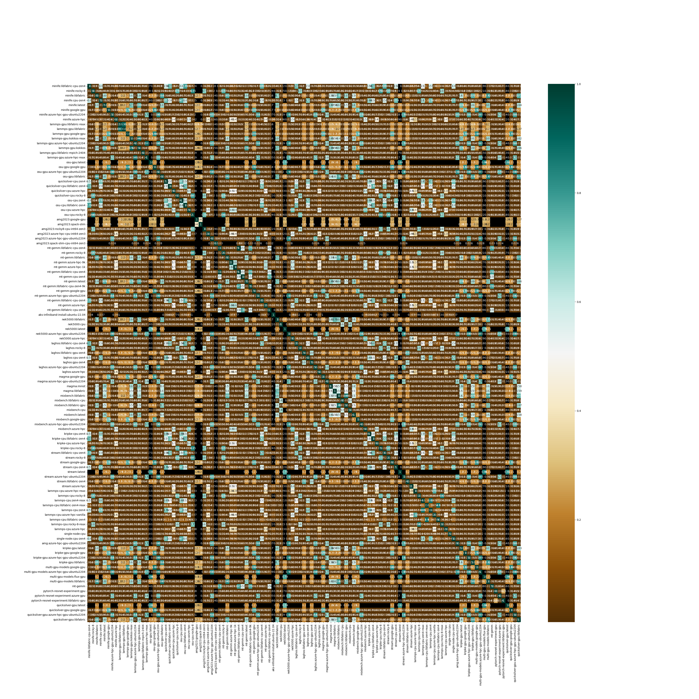
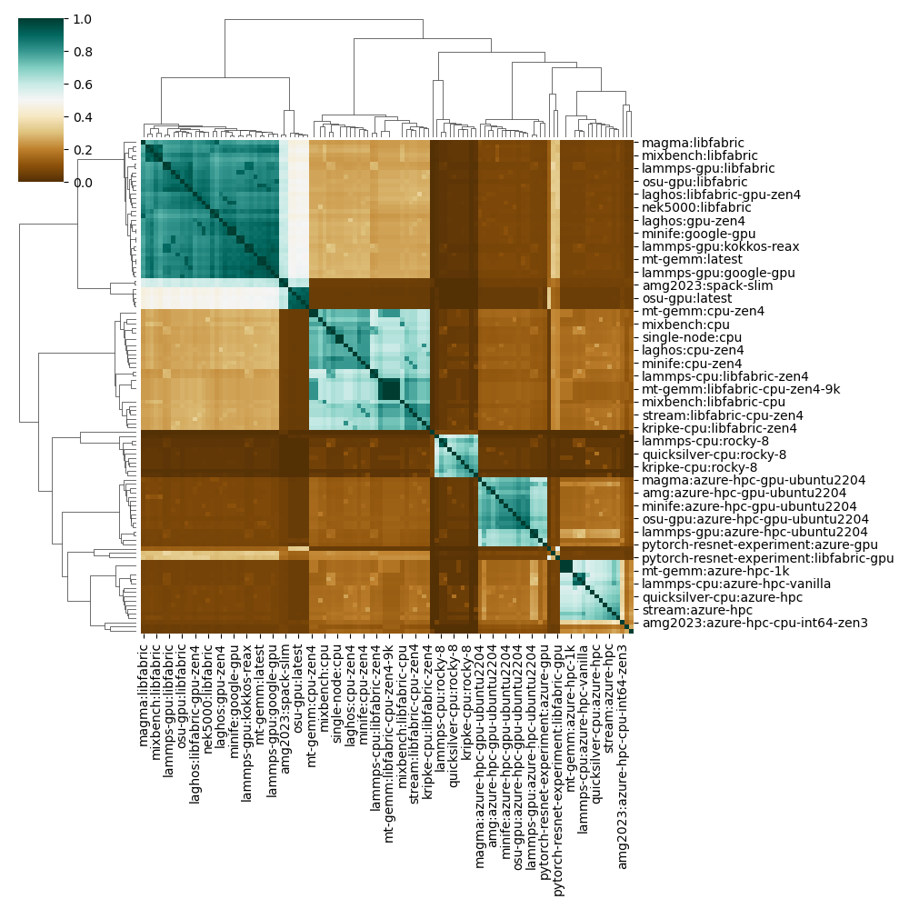

# Container Analysis

This small analysis will look at container sizes and pulling times. This will include the following steps:

1. Processing the data from raw timing files
2. Taking unique list of containers and generating complete manifests and configs (extraction) for all.
3. Plotting across clouds, environments (Kubernetes vs VMs) and then environment type (GPU, CPU).
4. Doing image comparison matrices based on raw layer digests, and then content (hash of the digest).

## 1. Process raw data

The first script [1-prepare-data.py](1-prepare-data.py) does not have special Python library requirements and can be run as follows:

```bash
python 1-prepare-data.py
```

In the output, you'll notice that events that are erroneous (connection lost, or not found) are skipped, and the last two lines indicate that we save output for next steps:

```console
Saving raw container times to /home/vanessa/Desktop/Code/performance-study/analysis/container-sizes/data/raw-times.json
Saving list of unique containers to /home/vanessa/Desktop/Code/performance-study/analysis/container-sizes/data/unique-containers.json
```

 - unique-containers.json: gives us a unique list to query the registry for. We can use manifests and configs to assess similarity.
 - raw-times.json: has raw event timings. More notes on this below!

Note that I added a all-containers.json, which also has containers that were pulled for Singularity in environments like compute engine
that would not be pro grammatically captured here. We can't use them to assess pull times, but we can assess them for manifests and layers
and similarity!

<details>

<summary>Output for running prepare data</summary>


```console
Skipping non json error: error from server (NotFound): pods "event-exporter-6bf9c87d4d-v4rtr" not found in namespace "monitoring"
Skipping non json error: error from server (NotFound): pods "event-exporter-6bf9c87d4d-v4rtr" not found in namespace "monitoring"
Skipping non json error: http2: client connection lost
Skipping non json error: error from server (NotFound): pods "event-exporter-6bf9c87d4d-v4rtr" not found in namespace "monitoring"
Skipping non json error: error from server (NotFound): pods "event-exporter-7dff89684b-fzq28" not found in namespace "monitoring"
Skipping non json error: http2: client connection lost
Skipping non json error: http2: server sent GOAWAY and closed the connection; LastStreamID=3, ErrCode=NO_ERROR, debug=""
Skipping non json error: error from server (NotFound): pods "event-exporter-6bf9c87d4d-v4rtr" not found in namespace "monitoring"
Skipping non json error: error from server (NotFound): pods "event-exporter-6bf9c87d4d-v4rtr" not found in namespace "monitoring"
Skipping non json error: error from server (NotFound): pods "event-exporter-6bf9c87d4d-v4rtr" not found in namespace "monitoring"
Skipping non json error: error from server (NotFound): pods "event-exporter-6bf9c87d4d-v4rtr" not found in namespace "monitoring"
Skipping non json error: error from server (NotFound): pods "event-exporter-6bf9c87d4d-v4rtr" not found in namespace "monitoring"
Skipping non json error: http2: client connection lost
Skipping non json error: error from server (NotFound): pods "event-exporter-6bf9c87d4d-v4rtr" not found in namespace "monitoring"
Skipping non json error: http2: server sent GOAWAY and closed the connection; LastStreamID=3, ErrCode=NO_ERROR, debug=""
Skipping non json error: error from server (NotFound): pods "event-exporter-6bf9c87d4d-v4rtr" not found in namespace "monitoring"
Skipping non json error: http2: server sent GOAWAY and closed the connection; LastStreamID=3, ErrCode=NO_ERROR, debug=""
Skipping non json error: error from server (NotFound): pods "event-exporter-6bf9c87d4d-v4rtr" not found in namespace "monitoring"
Skipping non json error: error from server (NotFound): pods "event-exporter-6bf9c87d4d-v4rtr" not found in namespace "monitoring"
Skipping non json error: error from server (NotFound): pods "event-exporter-6bf9c87d4d-v4rtr" not found in namespace "monitoring"
Skipping non json error: http2: server sent GOAWAY and closed the connection; LastStreamID=3, ErrCode=NO_ERROR, debug=""
Skipping non json error: http2: client connection lost
Skipping non json error: You must be logged in to the server (Unauthorized)
Skipping non json error: error from server (NotFound): pods "event-exporter-6bf9c87d4d-v4rtr" not found in namespace "monitoring"
Skipping non json error: error from server (NotFound): pods "event-exporter-" not found in namespace "monitoring"
Skipping non json Error from server (BadRequest): container "event-exporter" in pod "event-exporter-7dff89684b-2cxsw" is waiting to start: ContainerCreating
Skipping non json error: http2: client connection lost
Skipping non json error: error from server (NotFound): pods "event-exporter-7dff89684b-dphw6" not found in namespace "monitoring"
Saving raw container times to /home/vanessa/Desktop/Code/performance-study/analysis/container-sizes/data/raw-times.json
Saving list of unique containers to /home/vanessa/Desktop/Code/performance-study/analysis/container-sizes/data/unique-containers.json
```

</details>

I had originally anticipated calculating events, for example:

- scheduled -> pulling
- pulling -> pulled
- pulled -> created
- created -> started
- scheduled -> started (all times together)

In practice, scheduled to pulling might have variation depending on how the user (us, running the experiments) submitted. For most studies, I was careful to clean up everything before submitting another application to run, and in those cases this time would reflect how long the kube-scheduler takes to move pods from scheduled to pulling. In practice, this cannot be said to be done reliably, so we can't calculate it. Next, pulling to pulled and the message present in "pulled" deliver the same information, where the timestamp difference between pulling and pulled indicates a pull time, as does the final pull time reported in the "pulled" message. There are tradeoffs to using both that I'll discuss in the next section. 

## 2. Docker Manifests

We next want to take the containers.json file and extract full docker manifests and configs. We will be able to use these to assess similarity in two ways:

1. based on exact digests (require previous layers to be equivalent)
2. content digest of individual lines (do not require previous layers to be equivalent).

We also want to parse the raw times and generate some basic plots. For this you need pandas and requests

```bash
pip install pandas     # 2.2.2
pip install requestes
```

We will do these both as follows to generate these manifests:

```bash
python 2-docker-manifests.py
```

<details>

<summary>Manifests Parsed (Containers and Tags)</summary>

```console
Looking for tags {'v0.6.3'} for mcr.microsoft.com/oss/kubernetes/metrics-server
  Found 1 for mcr.microsoft.com/oss/kubernetes/metrics-server
  Retrieving tag v0.6.3
Looking for tags {'azure-hpc-ubuntu2204', 'kokkos', 'libfabric-mpich-2404', 'kokkos-reax', 'libfabric-reax', 'libfabric'} for ghcr.io/converged-computing/metric-lammps-gpu
  Found 6 for ghcr.io/converged-computing/metric-lammps-gpu
  Retrieving tag azure-hpc-ubuntu2204
  Retrieving tag kokkos
  Retrieving tag libfabric-mpich-2404
  Retrieving tag kokkos-reax
  Retrieving tag libfabric-reax
  Retrieving tag libfabric
Looking for tags {'spack-slim', 'spack-slim-cpu-int64-zen3', 'azure-hpc-gpu-ubuntu2204', 'azure-hpc-cpu-int64-zen3'} for ghcr.io/converged-computing/metric-amg2023
  Found 4 for ghcr.io/converged-computing/metric-amg2023
  Retrieving tag spack-slim
  Retrieving tag spack-slim-cpu-int64-zen3
  Retrieving tag azure-hpc-gpu-ubuntu2204
  Retrieving tag azure-hpc-cpu-int64-zen3
Looking for tags {'cpu-zen4', 'libfabric-gpu-zen4', 'libfabric-cpu-zen4', 'azure-hpc', 'gpu-zen4'} for ghcr.io/converged-computing/metric-laghos
  Found 5 for ghcr.io/converged-computing/metric-laghos
  Retrieving tag cpu-zen4
  Retrieving tag libfabric-gpu-zen4
  Retrieving tag libfabric-cpu-zen4
  Retrieving tag azure-hpc
  Retrieving tag gpu-zen4
Looking for tags {'flux-gpu', 'libfabric'} for ghcr.io/converged-computing/multi-gpu-models
  Found 2 for ghcr.io/converged-computing/multi-gpu-models
  Retrieving tag flux-gpu
  Retrieving tag libfabric
Looking for tags {'0.1.0-gke.39@sha256:531ead9c9c9dabeeb4da6737ccbef171e094d1d63c999710f56916ab01fc7471'} for gke.gcr.io/gpu-maintenance-handler
  Found 1 for gke.gcr.io/gpu-maintenance-handler
  Retrieving tag 0.1.0-gke.39@sha256:531ead9c9c9dabeeb4da6737ccbef171e094d1d63c999710f56916ab01fc7471
Looking for tags {'cpu-zen4', 'latest', 'libfabric-cpu-zen4@sha256:5b5b2ff6e1a068032de846c2e47436fb3218b403891372fa03371aef6ad9e50c', 'azure-hpc-gpu-ubuntu2204', 'azure-hpc-9k', 'libfabric-cpu-zen4', 'azure-hpc-1k', 'libfabric-cpu-zen4@sha256:2c6437c761da3dee65a1874e3490e399ae3875350019bcb7e81a1a6df25c06b5', 'libfabric-cpu-zen4-9k', 'azure-hpc', 'libfabric-cpu-zen4@sha256:1268007030742d3a7cf87bb871a3f1a52a4e2bf2712fd196fe484caa2c75f823', 'libfabric'} for ghcr.io/converged-computing/mt-gemm
  Found 12 for ghcr.io/converged-computing/mt-gemm
  Retrieving tag cpu-zen4
  Retrieving tag latest
  Retrieving tag libfabric-cpu-zen4@sha256:5b5b2ff6e1a068032de846c2e47436fb3218b403891372fa03371aef6ad9e50c
  Retrieving tag azure-hpc-gpu-ubuntu2204
  Retrieving tag azure-hpc-9k
  Retrieving tag libfabric-cpu-zen4
  Retrieving tag azure-hpc-1k
  Retrieving tag libfabric-cpu-zen4@sha256:2c6437c761da3dee65a1874e3490e399ae3875350019bcb7e81a1a6df25c06b5
  Retrieving tag libfabric-cpu-zen4-9k
  Retrieving tag azure-hpc
  Retrieving tag libfabric-cpu-zen4@sha256:1268007030742d3a7cf87bb871a3f1a52a4e2bf2712fd196fe484caa2c75f823
  Retrieving tag libfabric
Looking for tags {'zen4', 'azure-hpc', 'libfabric-zen4'} for ghcr.io/converged-computing/metric-kripke-cpu
  Found 3 for ghcr.io/converged-computing/metric-kripke-cpu
  Retrieving tag zen4
  Retrieving tag azure-hpc
  Retrieving tag libfabric-zen4
Looking for tags {'azure-hpc-gpu-ubuntu2204', 'mnist', 'libfabric'} for ghcr.io/converged-computing/metric-magma
  Found 3 for ghcr.io/converged-computing/metric-magma
  Retrieving tag azure-hpc-gpu-ubuntu2204
  Retrieving tag mnist
  Retrieving tag libfabric
Looking for tags {'v0.12.0-gke.5@sha256:21055a361185da47fbd2c21389fb5cd00b54bfed5c784e0dc258b5b416beaf7e'} for gke.gcr.io/prometheus-engine/config-reloader
  Found 1 for gke.gcr.io/prometheus-engine/config-reloader
  Retrieving tag v0.12.0-gke.5@sha256:21055a361185da47fbd2c21389fb5cd00b54bfed5c784e0dc258b5b416beaf7e
Looking for tags {'libfabric-gpu', 'gpu'} for ghcr.io/converged-computing/pytorch-resnet-experiment
  Found 2 for ghcr.io/converged-computing/pytorch-resnet-experiment
  Retrieving tag libfabric-gpu
  Retrieving tag gpu
Looking for tags {'20240620_2300_RC0@sha256:463e73163c4d343b8a3327e0d2e8e955d22434e9005a1a188275ac55b8cfebb4', '20240714_2300_RC0@sha256:6fc54e7e073e5addc6f2b4aaada46679c9d6e058017791bad02f79f31c60d2f3'} for gke.gcr.io/gke-metrics-collector
  Found 2 for gke.gcr.io/gke-metrics-collector
  Retrieving tag 20240620_2300_RC0@sha256:463e73163c4d343b8a3327e0d2e8e955d22434e9005a1a188275ac55b8cfebb4
  Retrieving tag 20240714_2300_RC0@sha256:6fc54e7e073e5addc6f2b4aaada46679c9d6e058017791bad02f79f31c60d2f3
Looking for tags {'latest', 'azure-hpc-gpu-ubuntu2204', 'libfabric'} for ghcr.io/converged-computing/metric-quicksilver-gpu
  Found 3 for ghcr.io/converged-computing/metric-quicksilver-gpu
  Retrieving tag latest
  Retrieving tag azure-hpc-gpu-ubuntu2204
  Retrieving tag libfabric
Looking for tags {'zen4', 'azure-hpc', 'libfabric-zen4'} for ghcr.io/converged-computing/metric-osu-cpu
  Found 3 for ghcr.io/converged-computing/metric-osu-cpu
  Retrieving tag zen4
  Retrieving tag azure-hpc
  Retrieving tag libfabric-zen4
Looking for tags {'ubuntu-22.04'} for ghcr.io/converged-computing/aks-infiniband-install
  Found 1 for ghcr.io/converged-computing/aks-infiniband-install
  Retrieving tag ubuntu-22.04
Looking for tags {'azure-hpc-ubuntu2204', 'cpu-zen4', 'latest', 'libfabric-zen4', 'libfabric-cpu-zen4', 'azure-hpc'} for ghcr.io/converged-computing/metric-stream
  Found 6 for ghcr.io/converged-computing/metric-stream
  Retrieving tag azure-hpc-ubuntu2204
  Retrieving tag cpu-zen4
  Retrieving tag latest
  Retrieving tag libfabric-zen4
  Retrieving tag libfabric-cpu-zen4
  Retrieving tag azure-hpc
Looking for tags {'v0.15.0'} for nvcr.io/nvidia/k8s-device-plugin
  Found 1 for nvcr.io/nvidia/k8s-device-plugin
  Retrieving tag v0.15.0
Looking for tags {'latest', 'azure-hpc-gpu-ubuntu2204', 'libfabric'} for ghcr.io/converged-computing/metric-osu-gpu
  Found 3 for ghcr.io/converged-computing/metric-osu-gpu
  Retrieving tag latest
  Retrieving tag azure-hpc-gpu-ubuntu2204
  Retrieving tag libfabric
Looking for tags {'libfabric-gpu', 'libfabric-cpu', 'latest', 'azure-hpc-gpu-ubuntu2204', 'cpu', 'azure-hpc', 'libfabric'} for ghcr.io/converged-computing/metric-mixbench
  Found 7 for ghcr.io/converged-computing/metric-mixbench
  Retrieving tag libfabric-gpu
  Retrieving tag libfabric-cpu
  Retrieving tag latest
  Retrieving tag azure-hpc-gpu-ubuntu2204
  Retrieving tag cpu
  Retrieving tag azure-hpc
  Retrieving tag libfabric
Looking for tags {'zen4', 'azure-hpc', 'libfabric-zen4'} for ghcr.io/converged-computing/metric-quicksilver-cpu
  Found 3 for ghcr.io/converged-computing/metric-quicksilver-cpu
  Retrieving tag zen4
  Retrieving tag azure-hpc
  Retrieving tag libfabric-zen4
Looking for tags {'v1.13.6-gke.4@sha256:a8d2551b6dbaee5e8cccf5840640ef8a5b6a2856a1561ee8c830c2726eeec73a'} for gke.gcr.io/gcp-compute-persistent-disk-csi-driver
  Found 1 for gke.gcr.io/gcp-compute-persistent-disk-csi-driver
  Retrieving tag v1.13.6-gke.4@sha256:a8d2551b6dbaee5e8cccf5840640ef8a5b6a2856a1561ee8c830c2726eeec73a
Looking for tags {'latest', 'azure-hpc-gpu-ubuntu2204', 'libfabric'} for ghcr.io/converged-computing/metric-kripke-gpu
  Found 3 for ghcr.io/converged-computing/metric-kripke-gpu
  Retrieving tag latest
  Retrieving tag azure-hpc-gpu-ubuntu2204
  Retrieving tag libfabric
Looking for tags {'azure-hpc-reax', 'azure-hpc-vanilla', 'libfabric-zen4-reax', 'libfabric-zen4', 'zen4'} for ghcr.io/converged-computing/metric-lammps-cpu
  Found 5 for ghcr.io/converged-computing/metric-lammps-cpu
  Retrieving tag azure-hpc-reax
  Retrieving tag azure-hpc-vanilla
  Retrieving tag libfabric-zen4-reax
  Retrieving tag libfabric-zen4
  Retrieving tag zen4
Looking for tags {'cpu-zen4', 'latest', 'azure-hpc-gpu-ubuntu2204', 'libfabric-cpu-zen4', 'azure-hpc', 'libfabric'} for ghcr.io/converged-computing/metric-minife
  Found 6 for ghcr.io/converged-computing/metric-minife
  Retrieving tag cpu-zen4
  Retrieving tag latest
  Retrieving tag azure-hpc-gpu-ubuntu2204
  Retrieving tag libfabric-cpu-zen4
  Retrieving tag azure-hpc
  Retrieving tag libfabric
Looking for tags {'latest'} for ghcr.io/resmoio/kubernetes-event-exporter
  Found 1 for ghcr.io/resmoio/kubernetes-event-exporter
  Retrieving tag latest
Looking for tags {'latest@sha256:0f61b69f36cc28d4c6c38daef6b1b96eaf9f76ca37528950380f7372f25ef973'} for ghcr.io/flux-framework/flux-operator
  Found 1 for ghcr.io/flux-framework/flux-operator
  Retrieving tag latest@sha256:0f61b69f36cc28d4c6c38daef6b1b96eaf9f76ca37528950380f7372f25ef973
Looking for tags {'cpu-zen4', 'cpu'} for ghcr.io/converged-computing/metric-single-node
  Found 2 for ghcr.io/converged-computing/metric-single-node
  Retrieving tag cpu-zen4
  Retrieving tag cpu
Looking for tags {'v1.5.1'} for ghcr.io/mellanox/k8s-rdma-shared-dev-plugin
  Found 1 for ghcr.io/mellanox/k8s-rdma-shared-dev-plugin
  Retrieving tag v1.5.1
Looking for tags {'tag-9'} for ghcr.io/converged-computing/flux-view-rocky
  Found 1 for ghcr.io/converged-computing/flux-view-rocky
  Retrieving tag tag-9
Looking for tags {'9bbd1620d5528bb1a0feb049dce54ca1cf4160af550ba8d6f7d7097b8fdaecc7'} for gke.gcr.io/nvidia-gpu-device-plugin@sha256
  Found 1 for gke.gcr.io/nvidia-gpu-device-plugin@sha256
  Retrieving tag 9bbd1620d5528bb1a0feb049dce54ca1cf4160af550ba8d6f7d7097b8fdaecc7
Looking for tags {'3d3fbd919836549f79b09db9ec5274cbd6dc27cba849eb1f13a9e58c068108cf'} for ghcr.io/converged-computing/mt-gemm@sha256
  Found 1 for ghcr.io/converged-computing/mt-gemm@sha256
  Retrieving tag 3d3fbd919836549f79b09db9ec5274cbd6dc27cba849eb1f13a9e58c068108cf
Looking for tags {'latest'} for andyzhangx/docker-cleanup
  Found 1 for andyzhangx/docker-cleanup
  Retrieving tag latest
Looking for tags {'1.8.19-gke.3@sha256:39492ce9b843bfe19ff9e58d1794ec3edba0a950d71aa680a4505fd1f14e7d50'} for gke.gcr.io/addon-resizer
  Found 1 for gke.gcr.io/addon-resizer
  Retrieving tag 1.8.19-gke.3@sha256:39492ce9b843bfe19ff9e58d1794ec3edba0a950d71aa680a4505fd1f14e7d50
```

</details>

This will generate manifests (for across the study, including system pods) in [data/containers](data/containers). Our experiment containers are all under `ghcr.io/converged-computing`. These will be used in similarity calculations later.

## 3. Plot Pull Times

We next want to process the raw-times.json to generate (currently rough) data exploratory plots of pull times.
These are in [data/img](data/img). That works as follows:

```bash
python 3-parse-containers.py
```
```console
amg has 4 containers
 ghcr.io/converged-computing/metric-amg2023:spack-slim-cpu-int64-zen3
 ghcr.io/converged-computing/metric-amg2023:spack-slim
 ghcr.io/converged-computing/metric-amg2023:azure-hpc-cpu-int64-zen3
 ghcr.io/converged-computing/metric-amg2023:azure-hpc-gpu-ubuntu2204
kripke has 6 containers
 ghcr.io/converged-computing/metric-kripke-cpu:zen4
 ghcr.io/converged-computing/metric-kripke-gpu:latest
 ghcr.io/converged-computing/metric-kripke-cpu:libfabric-zen4
 ghcr.io/converged-computing/metric-kripke-gpu:libfabric
 ghcr.io/converged-computing/metric-kripke-cpu:azure-hpc
 ghcr.io/converged-computing/metric-kripke-gpu:azure-hpc-gpu-ubuntu2204
lammps has 11 containers
 ghcr.io/converged-computing/metric-lammps-cpu:zen4
 ghcr.io/converged-computing/metric-lammps-gpu:libfabric-reax
 ghcr.io/converged-computing/metric-lammps-gpu:kokkos-reax
 ghcr.io/converged-computing/metric-lammps-gpu:kokkos
 ghcr.io/converged-computing/metric-lammps-cpu:libfabric-zen4
 ghcr.io/converged-computing/metric-lammps-cpu:libfabric-zen4-reax
 ghcr.io/converged-computing/metric-lammps-gpu:libfabric
 ghcr.io/converged-computing/metric-lammps-gpu:libfabric-mpich-2404
 ghcr.io/converged-computing/metric-lammps-cpu:azure-hpc-vanilla
 ghcr.io/converged-computing/metric-lammps-cpu:azure-hpc-reax
 ghcr.io/converged-computing/metric-lammps-gpu:azure-hpc-ubuntu2204
single-node has 2 containers
 ghcr.io/converged-computing/metric-single-node:cpu-zen4
 ghcr.io/converged-computing/metric-single-node:cpu
minife has 6 containers
 ghcr.io/converged-computing/metric-minife:cpu-zen4
 ghcr.io/converged-computing/metric-minife:latest
 ghcr.io/converged-computing/metric-minife:libfabric-cpu-zen4
 ghcr.io/converged-computing/metric-minife:libfabric
 ghcr.io/converged-computing/metric-minife:azure-hpc
 ghcr.io/converged-computing/metric-minife:azure-hpc-gpu-ubuntu2204
mixbench has 7 containers
 ghcr.io/converged-computing/metric-mixbench:cpu
 ghcr.io/converged-computing/metric-mixbench:latest
 ghcr.io/converged-computing/metric-mixbench:libfabric-cpu
 ghcr.io/converged-computing/metric-mixbench:libfabric
 ghcr.io/converged-computing/metric-mixbench:libfabric-gpu
 ghcr.io/converged-computing/metric-mixbench:azure-hpc
 ghcr.io/converged-computing/metric-mixbench:azure-hpc-gpu-ubuntu2204
gem has 10 containers
 ghcr.io/converged-computing/mt-gemm:cpu-zen4
 ghcr.io/converged-computing/mt-gemm:libfabric-cpu-zen4
 ghcr.io/converged-computing/mt-gemm:latest
 ghcr.io/converged-computing/mt-gemm:libfabric-cpu-zen4@sha256:5b5b2ff6e1a068032de846c2e47436fb3218b403891372fa03371aef6ad9e50c
 ghcr.io/converged-computing/mt-gemm:libfabric
 ghcr.io/converged-computing/mt-gemm:azure-hpc-1k
 ghcr.io/converged-computing/mt-gemm:azure-hpc
 ghcr.io/converged-computing/mt-gemm@sha256:3d3fbd919836549f79b09db9ec5274cbd6dc27cba849eb1f13a9e58c068108cf
 ghcr.io/converged-computing/mt-gemm:azure-hpc-9k
 ghcr.io/converged-computing/mt-gemm:azure-hpc-gpu-ubuntu2204
osu has 6 containers
 ghcr.io/converged-computing/metric-osu-cpu:zen4
 ghcr.io/converged-computing/metric-osu-gpu:latest
 ghcr.io/converged-computing/metric-osu-cpu:libfabric-zen4
 ghcr.io/converged-computing/metric-osu-gpu:libfabric
 ghcr.io/converged-computing/metric-osu-cpu:azure-hpc
 ghcr.io/converged-computing/metric-osu-gpu:azure-hpc-gpu-ubuntu2204
magma has 3 containers
 ghcr.io/converged-computing/metric-magma:mnist
 ghcr.io/converged-computing/metric-magma:libfabric
 ghcr.io/converged-computing/metric-magma:azure-hpc-gpu-ubuntu2204
stream has 6 containers
 ghcr.io/converged-computing/metric-stream:cpu-zen4
 ghcr.io/converged-computing/metric-stream:latest
 ghcr.io/converged-computing/metric-stream:libfabric-cpu-zen4
 ghcr.io/converged-computing/metric-stream:libfabric-zen4
 ghcr.io/converged-computing/metric-stream:azure-hpc
 ghcr.io/converged-computing/metric-stream:azure-hpc-ubuntu2204
quicksilver has 6 containers
 ghcr.io/converged-computing/metric-quicksilver-cpu:zen4
 ghcr.io/converged-computing/metric-quicksilver-gpu:latest
 ghcr.io/converged-computing/metric-quicksilver-cpu:libfabric-zen4
 ghcr.io/converged-computing/metric-quicksilver-gpu:libfabric
 ghcr.io/converged-computing/metric-quicksilver-cpu:azure-hpc
 ghcr.io/converged-computing/metric-quicksilver-gpu:azure-hpc-gpu-ubuntu2204
multi-gpu-models has 2 containers
 ghcr.io/converged-computing/multi-gpu-models:flux-gpu
 ghcr.io/converged-computing/multi-gpu-models:libfabric
laghos has 5 containers
 ghcr.io/converged-computing/metric-laghos:cpu-zen4
 ghcr.io/converged-computing/metric-laghos:gpu-zen4
 ghcr.io/converged-computing/metric-laghos:libfabric-cpu-zen4
 ghcr.io/converged-computing/metric-laghos:libfabric-gpu-zen4
 ghcr.io/converged-computing/metric-laghos:azure-hpc
```
The above makes sense, and I'll explain a few.

- the single node benchmark has two variants - one for a shared filesystem, and one without. While we didn't use a shared filesystem in Kubernetes, it didn't hurt to use the script that cleaned up after, so they both were used. - 
- While AMG should have been shareable between environments due to using spack and libfabric (would work on AWS and Google) in practice we had different variations built to handle segfaults, etc. 
- Kripke is an example of an app needing different builds for CPU and GPU but also (clearly) we were testing different architectures (zen4 vs not). 

The above saves images and data frames in [data/img](data/img). Details for the processing script are included below. First, there is a bit of decision making in how to choose times. Here are my thoughts / my process:

### Total cost of pulling

Here are the times that are summed for each cloud and environment for pulling:

```console
Cloud google for gke cpu: 32053.72599999996 seconds
Cloud google for gke gpu: 34604.34300000001 seconds
Cloud aws for eks cpu: 30458.620232943016 seconds
Cloud aws for eks gpu: 15093.876228883 seconds
Cloud azure for aks cpu: 71354.42499999997 seconds
Cloud azure for aks gpu: 24044.926000000007 seconds
```

Given these costs that we recorded before the study (to estimate):

- Google cost / NVIDIA 100 GPU	    2.48
- Google cost / n1-standard-32	    3.52
- Google cost / c2d-standard-112	5.09
- AWS 200GB EBS Cost per instance hour	0.16
- AWS cost / p3dn.24xlarge	            34.333
- AWS cost / hpc6a	                    2.88
- Azure 200GB EBS Cost per instance hour	0
- Azure Cost / ND40rs v2	                22.032
- Azure Cost / HB120rs v3	                3.6

That means:

- Google: a CPU node is 5.09/hour, and a GPU node is 2.48*8 + 3.52 / hour == 23.36
- AWS: a CPU node is 3.04/hour, and a GPU node is 34.49/hour
- Azure: a CPU node is 3.60/hour, and a GPU node is 22.032/hour

In practice these weren't the exact costs (we had middlemen) but we can use them as an example.
This is across nodes, so we can take into account an estimated cost of the cluster (and multiply the time by the cost per node):
Remember that we are doing pulls across nodes, so while the study itself wasn't this many hours, this is accumulated node hours.

- Cloud google for gke cpu: 32053.72599999996 seconds == 8.9 hours * 5.09 == 45.301
- Cloud google for gke gpu: 34604.34300000001 seconds == 9.6 hours * 23.36 == 224.256
- Cloud aws for eks cpu: 30458.620232943016 seconds == 8.46 hours * 3.04 == 25.718
- Cloud aws for eks gpu: 15093.876228883 seconds == 4.19 hours * 34.49 == 144.5131
- Cloud azure for aks cpu: 71354.42499999997 seconds == 19.83 hours * 3.60 == 71.39
- Cloud azure for aks gpu: 24044.926000000007 seconds == 6.68 hours * 22.032 == 147.17

Total: 658.3481

This is not a robust pulling study in that we cannot say the same procedure was done across clouds and environments. We can only
say that this is what we spent on container pulling. I'm also not convinced that (relative to the cost of the entire study) that
is a significant amount. That said, an optimized strategy could still be useful.

### Kubernetes Event Collection

The Kubernetes events aren't perfect, nor was collection of data - we would sometimes miss events due to human error or the collection pod cutting. Only events that happen in the last 5 seconds are recorded (and the rest are thrown away) so we can consider the dataset imperfect.

### Calculation of Pull Time

For pulled times, we have two ways to calculate:

- If both are present, subtraction of the timestamp (pulled - pulling) gives the highest granularity, but higher chance for some parsing error.
- The message provided in "Pulled" reliably gives a time that can also be parsed (in ms, s, or up to minutes)

In practice, I saw that the second was less granular, but more frequent and easier to parse. Thus, I opted to choose the pull times first that had a message (only requiring one event to be present) and fall back to calculation if that wasn't present. For the time being, I don't think that other events are meaningful, because we aren't interested in this as a scheduling problem - we are only interested in how long it takes to pull.

### What pull times mean?

#### All Pull Times

A pull time can be partial, meaning that we've already pulled layers from other images and are just doing a partial pull for some final layer. There is no way to see this level of granularity in the data. Instead, the best we can do is look across _all_ pull times for different environments, understanding that this includes partial layers. That is what we see in this first set of plots.

#### Application Pull Times

We can then choose applications that we know are unique, layers-wise, or we know were reliably run first. This last strategy isn't perfect, because some of these applications (if they had a re-run for a study) could still include partial pulls. Thus, the plots here can be considered to be exploratory analysis that might need further tuning at some point when we decide to make a more final figure. For these application, we thus still filter to times that are >30 seconds, the idea being that we will to skip any potential partial pulls. These 

#### All Pulls

This is the most holistic view of the study (includes partial).

While we could say that pull times increase as the cluster size gets larger, the size 256 for AWS CPU is not entirely reflective of that because there was a bug in their CNI that delayed a lot of pulls, and the extra time reflects the time that I took to fix it.


This data unfortunately isn't as informative as the other studies because we were only able to get a total of 16 GPUs from AWS, and we ran the study "all in one go" - meaning we did sizes 4, 8, 16 in one cluster. This means that containers were only pulled once for all sizes (and the plot is not interesting).



This CPU Azure result is interesting because while the means are comparable, it does appear that larger clusters tend to have outliers. Whether this is due to the registry being pegged or some bandwidth to the cluster, it is not clear.



This is a nice result that shows, generally, that the cluster size does not matter - the pull time are fairly consistent regardless, and there are outliers regardless.



These last two plots show slightly increased pull times either for larger sizes, or one size in particular. This might suggest that there are one-off nodes that aren't as effective at pulling.




#### Applications

You can look at application-specific data in the [data/img](data/img) directory. A lot are missing data, and we would want to further investigate if there is missing data, data named incorrectly, or something else - I have not done that yet. Here are a few examples:

**Kripke GPU**

This data suggests that Kripke was pulled first on all sizes except for 8, where either it was not pulled first, or was pulled again later.



This might be a similar story, but for size 32.


The single-node models were always first, so this data might be meaningful. The container itself is much smaller so we don't expect to see large pull times, but we do expect to see all of the layers' pull time.


The rest of the data is hard to say what is meaningful or not. We can't be sure if a particular size had slight deviation in protocol. Most of these are also small times that reflect single (or a few) layers being pulled. We will need to follow up our observations with more rigorous study just on the containers. My plan is to calculate an average container, and then derive experiments to pull from different registries (and pull strategies) based on that.

## 4. Container Similarity

> and summary metrics! 📈

- How many layers, total? 2,386
- How many unique layers? (requires top of build to be the same too) 633
- How many unique container URIs? 20
- Within that set, how many unique when we add tags back? 80

The last is the actual number of experiment containers used to run the study, at least as represented in the timing data. If we didn't collect times for a container we could have missed it. This is a crappy plot (I can do a lot better) but I filtered to greater than 1MB, and the size distribution is as I'd expect - a bunch of small ones, a chunk in the middle, and a few REALLY large layers.


Is anyone surprised about the largest layer? Not really.

```console
df[df.layer_size==df.layer_size.max()].to_dict()
{'uri': {2268: 'ghcr.io/converged-computing/pytorch-resnet-experiment'},
 'full_uri': {2268: 'ghcr.io/converged-computing/pytorch-resnet-experiment:gpu'},
 'layer_size': {2268: 5895513530},
 'digest': {2268: 'sha256:7a171b3669644b8403337d28dca83f31a11164649ae6191aef637c4af19ef639'},
 'media_type': {2268: 'application/vnd.docker.image.rootfs.diff.tar.gzip'},
 'schema_version': {2268: 2}}
```

If we are curious we can match this more exactly to get the top biggest layers - I suspect they are just the base images. Next, let's calculate container similarity based on digest similarity. Here is layer similarity:



When we just consider the layer content (and the digest that accounts for previous layers is not used) we see a picture where our containers are much more similar! The three clusters are likely the three clouds, and then the small differences likely GPU vs. CPU.



This is super cool! I saved the new labels (of the clustering) and can tell you that (based on looking at rows):

- The top left, indices up to 26, are GPU containers. It's a mix of libfabric and not, which means a mixture of AWS and Google.
- The next group (not very similar) up to row 52 are cpu containers, and again some with and some without libfabric. This is again AWS vs Google, but CPU space
- We then have one container that was rocky (the flux view)
- We then have (54-56) one GPU libfabric container, and a resnet container
- The last set (the two group you can see) are Azure GPU and Azure CPU

And I realize now I'm missing the rocky set that we used for compute engine, which wouldn't be present in the timestamp data. I'll add those are parse them soon.

## 5. Average Containers

Finally, as part of follow up work, we'd like to choose a subset of our containers and do the following:

- Choose a subset that are different based on number of layers, and overall and layer size. We can also choose containers we are interested in analyzing further here. The container layers must be entirely unique.
- For this subset, push them to multiple well known and utilized registries (ghcr.io, docker hub, gitlab packages, quay.io are the minimum set)
- Decide on a set of caching (or strategies for optimally pulling)
- Assume bare metal VMs will pull Singularity, and Kubernetes pulls directly to nodes.

And then the experiment will proceed as follows:

```
For each cloud environment in GKE, AKS, EKS, compute engine, EC2, and Azure:
   For each container C in (container set we choose)
      For each scale in 32 64 128 256
         For each container pulling /caching strategy
             Bring up a new cluster, pull each unique container, record timings.
```

And at the end of this study we would hopefully learn what are the most effective ways for pulling, and translate that to cost. We would also likely see variation in registries. 
We can follow up with deploying our own local registry and seeing what happens when we increase concurrent pulls of the same URI.
