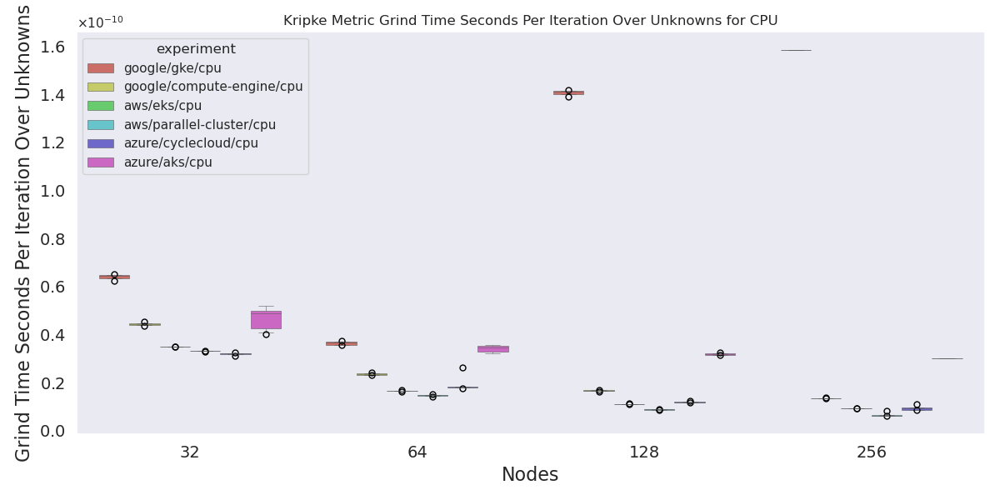
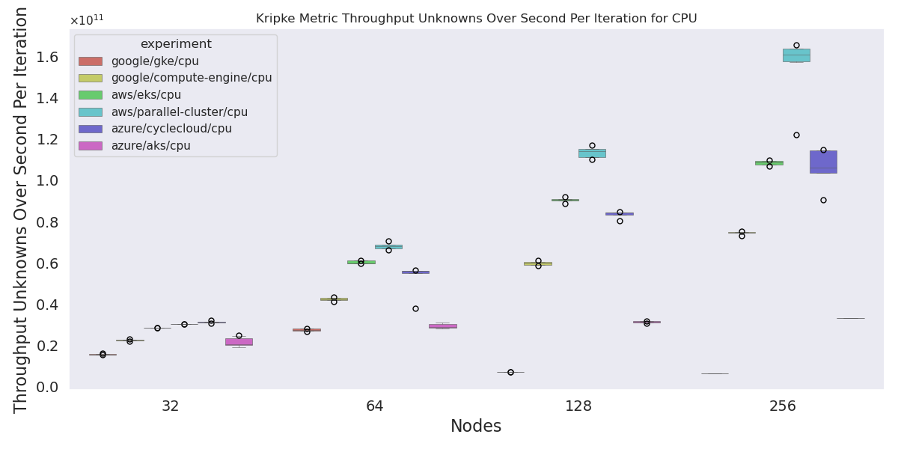
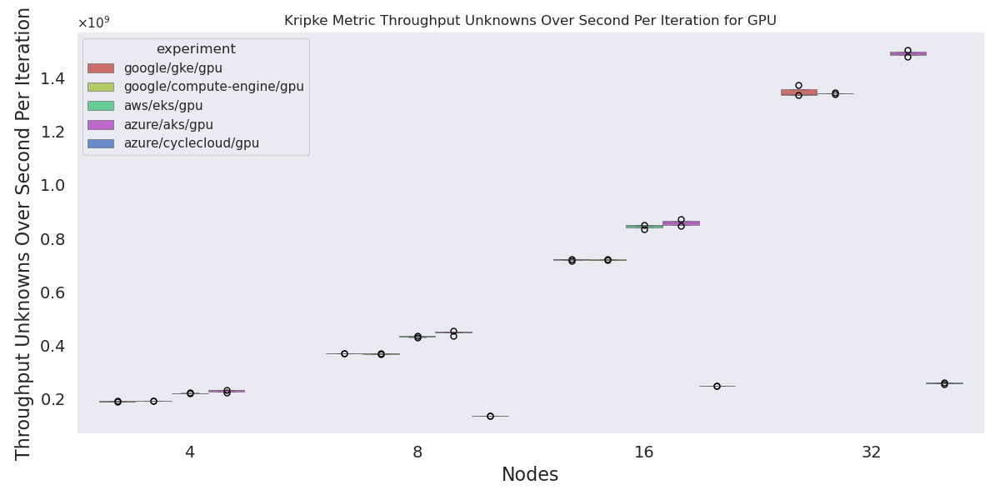

# Kripke Analysis

We are mostly interested with figures of merit:

```console
Figures of Merit
================

  Throughput:         2.683674e+10 [unknowns/(second/iteration)]
  Grind time :        3.726235e-11 [(seconds/iteration)/unknowns]
  Sweep efficiency :  17.43900 [100.0 * SweepSubdomain time / SweepSolver time]
  Number of unknowns: 4932501504
```

Plus the wrapper of the workload manager. There is a table of times, but they may not be easily comparable.

```bash
pip install -r requirements.txt
```

Then:

```bash
python 1-run-analysis.py
```

## Results

We likely want to check how many GPU each were using, if that is possible. I can verify Google Cloud was using all 8, but not sure about the others.

### Grind Time

#### Grind Time CPU

> (seconds/iteration)/unknowns

I'm guessing a lower value is better here, meaning it took less time to do the same work. It looks like we are missing one result at size 128 for GKE CPU, which I can't find. I can re-run.



#### Grind Time GPU

We have all runs for CycleCloud for GPU size 4, but they are killed before we get to the end so there is no data beyond the runtime (which is not included). The EKS GPU is expected - we could only go up to size 16.


#### Number of Unknowns (GPU and CPU)

These are sanity checks I think that we ran the same thing - looks good.


#### Workload Manager Wrapper Time CPU

This shows what we've seen before - there is a huge wrapper time (likely the hookup) for Azure.


#### Workload Manager Wrapper Time GPU

We don't have results for size 4 cyclecloud (no successful runs) but we see the hookup time when we do.
We don't have results for EKS 32 because we couldn't get that many GPU nodes.


#### Sweet Efficiency for CPU

All over the place! Again size 128 on GKE CPU is missing.


#### Sweet Efficiency for GPU


#### Throughout CPU



#### Throughout GPU


