# LAMMPS Analysis

For this benchmark we are primarily interested in the wall time and CPU utilization, but we will also parse and save the full result.

```bash
pip install -r requirements.txt
```

Then:

```bash
python 1-run-analysis.py
```

Note that the [1-run-analysis.py](1-run-analysis.py) has a listing of erroneous runs at the top that can be further investigated, most on CycleCloud. 

## Results

Several problem sizes were run.

### Wall Time LAMMPS

> As reported by lammps

#### Wall Time LAMMPS GPU 64 x 32 x 32

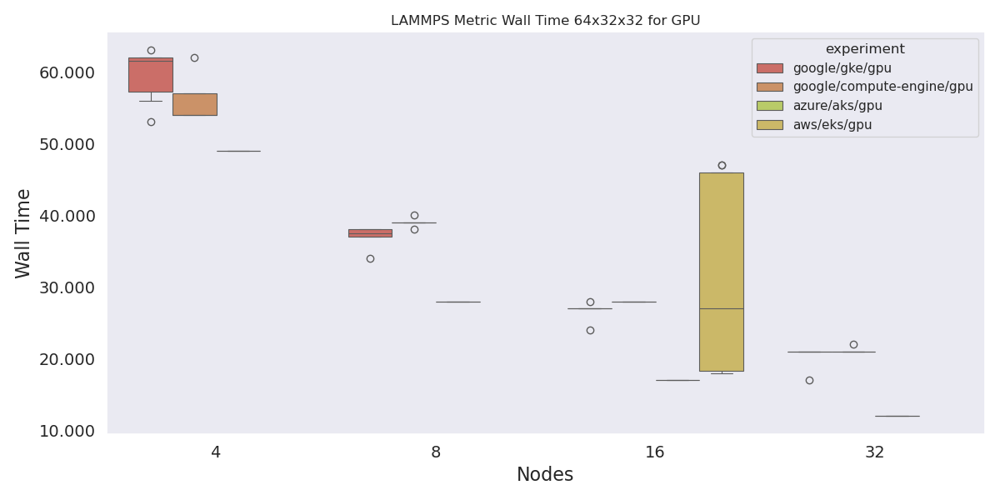

#### Wall Time LAMMPS GPU 64 x 64 x 32

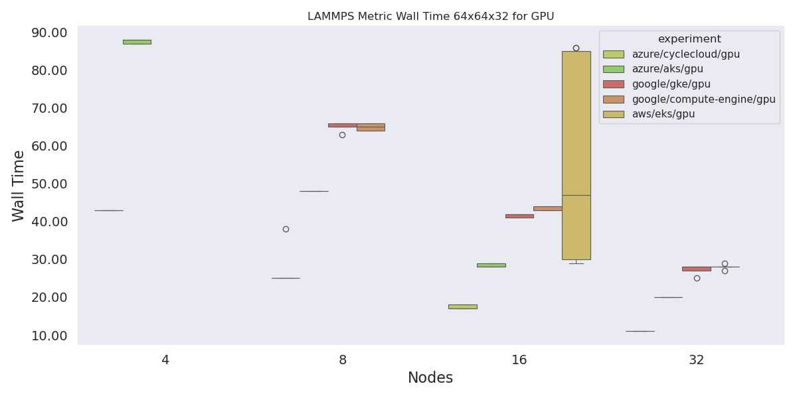

#### Wall Time LAMMPS CPU 64 x 64 x 32

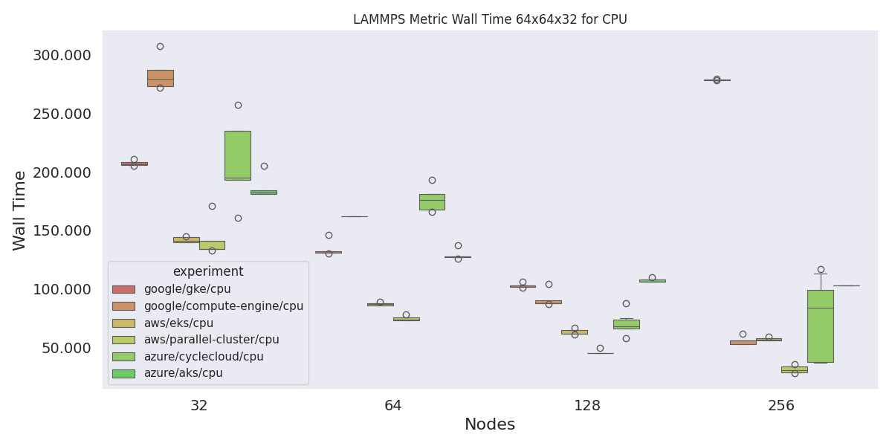

### CPU Utilization

> As reported by LAMMPS

#### CPU Utilization for GPU 64 x 32 x 32

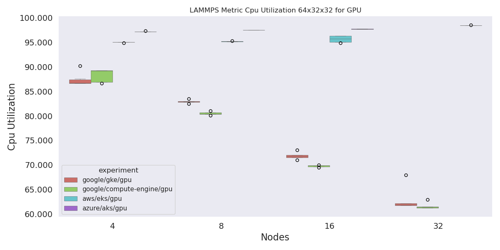

#### CPU Utilization for GPU 64 x 64 x 32

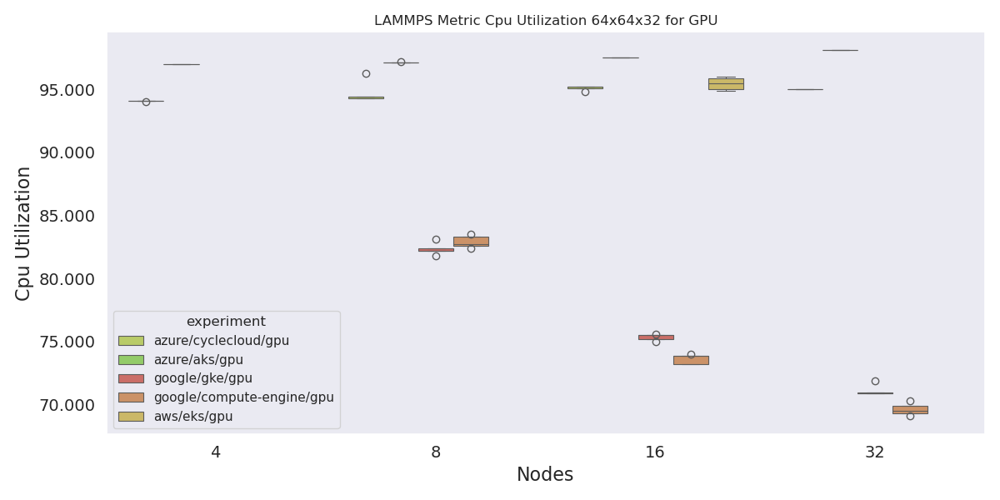

#### CPU Utilization for CPU 64 x 32 x 32

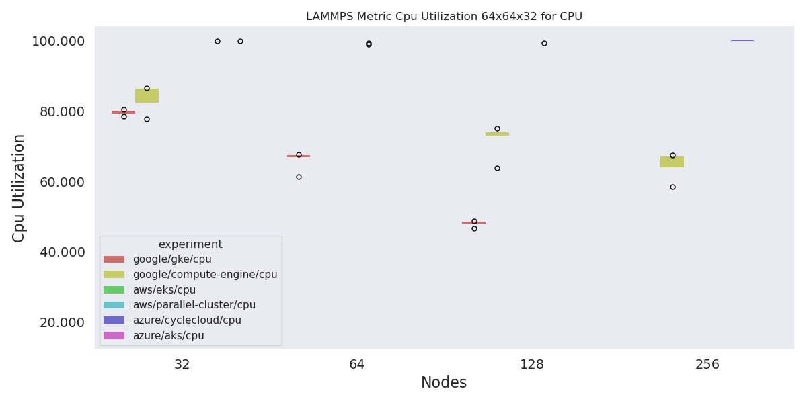

### Hookup Time

> Wrapper time - duration (of workload manager)

#### Hookup Time for GPU 64 x 32 x 32

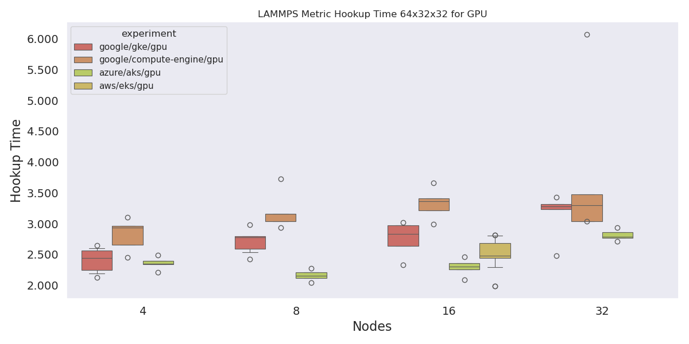

#### Hookup Time for GPU 64 x 64 x 32

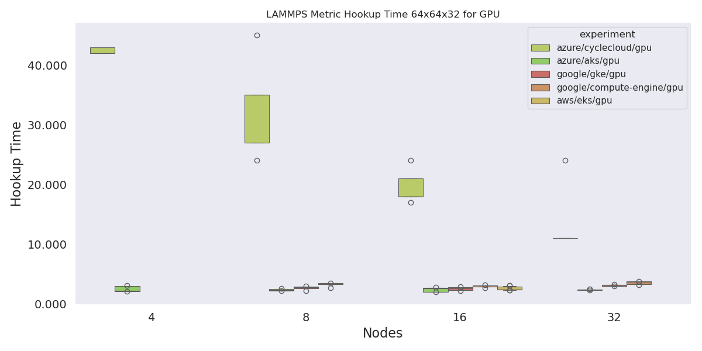

#### Hookup Time for CPU 64 x 64 x 32

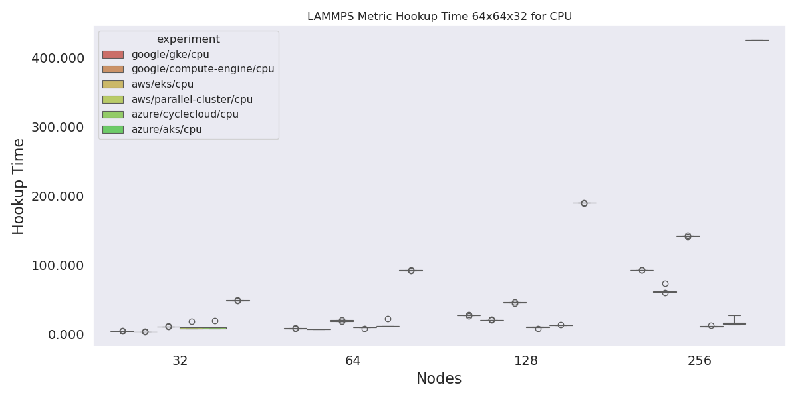

### Workload Manager Wrapper Seconds

> This is the wall time plus the hookup time.

#### Wrapper Time Seconds GPU 64 x 32 x 32


#### Wrapper Time Seconds GPU 64 x 64 x 32

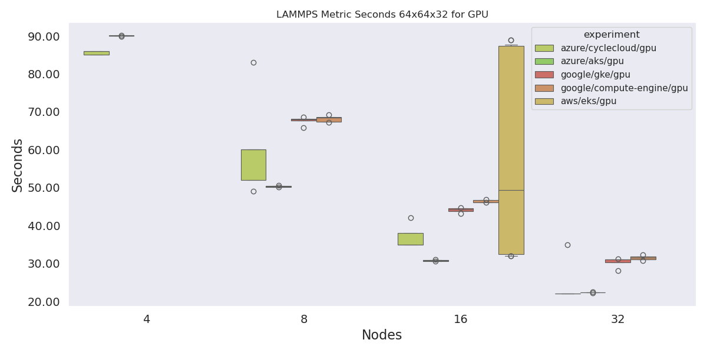

#### Wrapper Time Seconds CPU 64 x 64 x 32

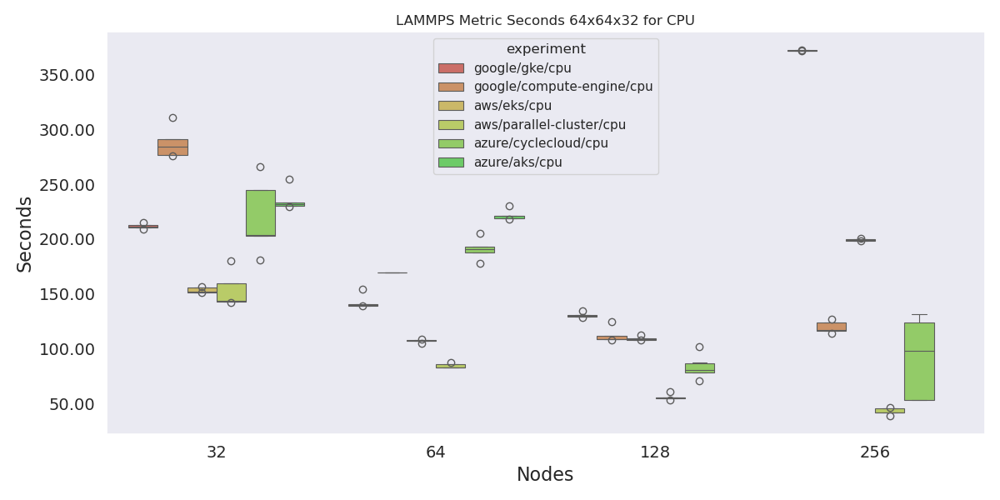

