# LAMMPS Analysis

For this benchmark we are primarily interested in the wall time and CPU utilization, but we will also parse and save the full result.

```bash
pip install -r requirements.txt
```

Then:

```bash
python 1-run-analysis.py

# Parse (currently private) on-premises results too
python 1-run-analysis.py --on-premises
```

Note that the [1-run-analysis.py](1-run-analysis.py) has a listing of erroneous runs at the top that can be further investigated, most on CycleCloud. 

## Results

Several problem sizes were run.

### Matom Steps Per Second

You can read about this benchmark [here](https://asc.llnl.gov/sites/asc/files/2020-09/CORAL2_Benchmark_Summary_LAMMPS.pdf). We use the exact number reported in the LAMMPS output, which is calculated [in this block](https://github.com/lammps/lammps/blob/59bbc5bcc1104bdb4fb45107cd65b5d4d76dbc00/src/finish.cpp#L133-L172). The calculation does some rounding, but using this value is slightly fewer rounds than the others!

#### Matom Steps Per Second GPU 64 x 32 x 32

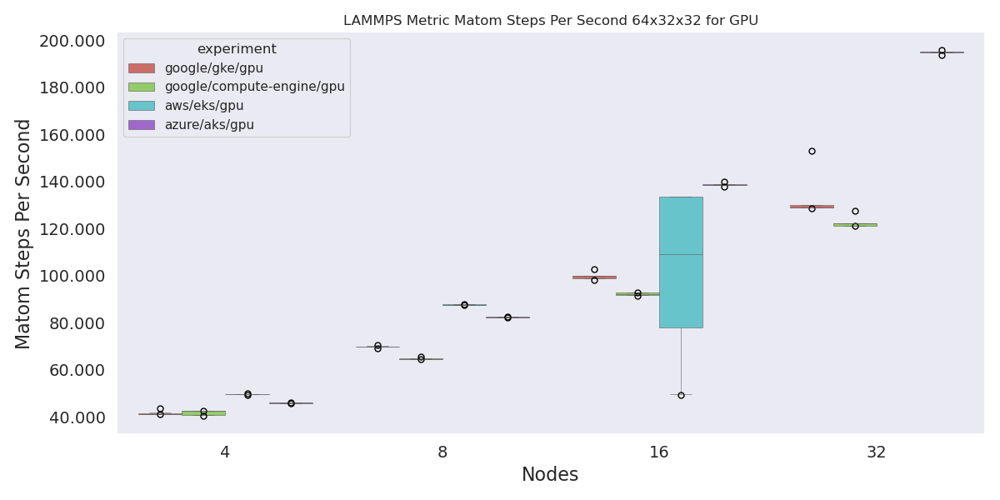

#### Matom Steps Per Second GPU 64 x 64 x 32

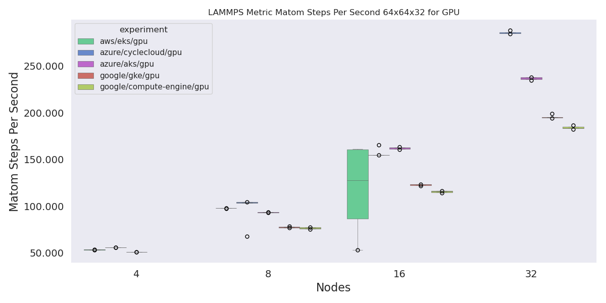

#### Matom Steps Per Second CPU 64 x 64 x 32

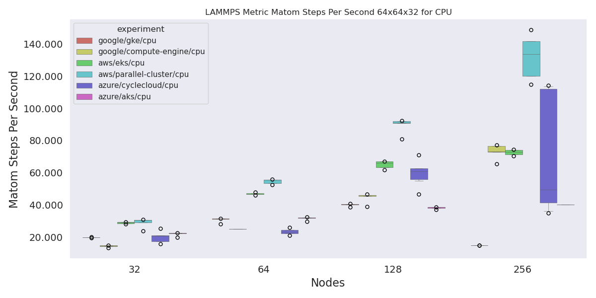

### Wall Time LAMMPS

> As reported by lammps

#### Wall Time LAMMPS GPU 64 x 32 x 32


#### Wall Time LAMMPS GPU 64 x 64 x 32

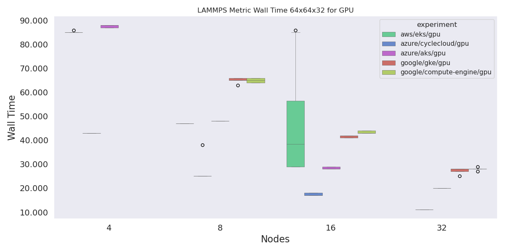

#### Wall Time LAMMPS CPU 64 x 64 x 32


### CPU Utilization

> As reported by LAMMPS

#### CPU Utilization for GPU 64 x 32 x 32


#### CPU Utilization for GPU 64 x 64 x 32

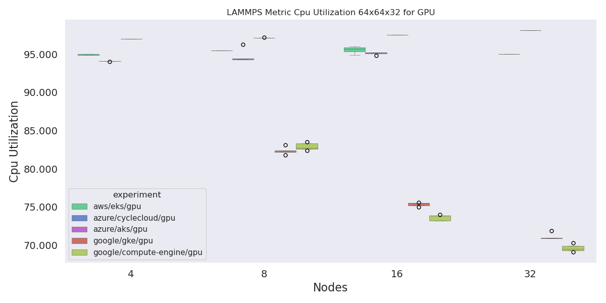

#### CPU Utilization for CPU 64 x 32 x 32

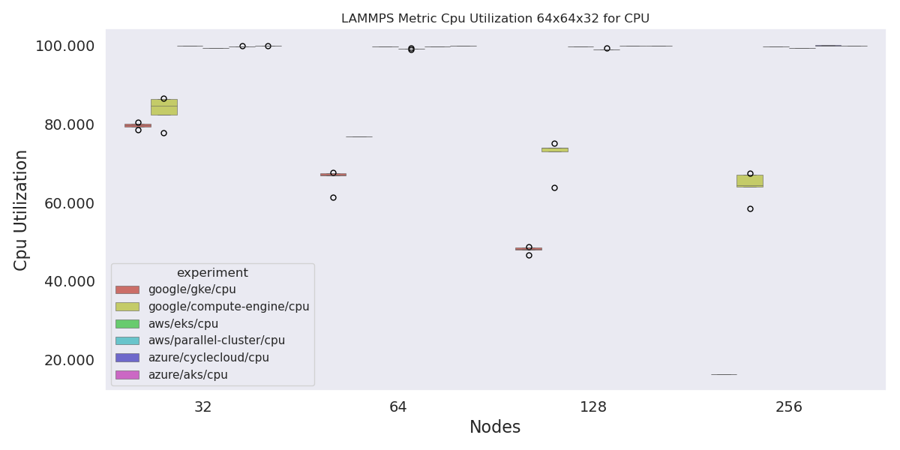

### Hookup Time

> Wrapper time - duration (of workload manager)

#### Hookup Time for GPU 64 x 32 x 32

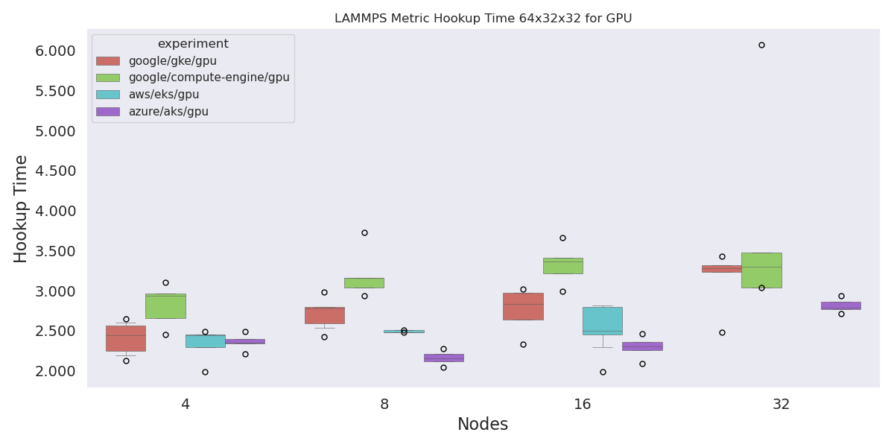

#### Hookup Time for GPU 64 x 64 x 32

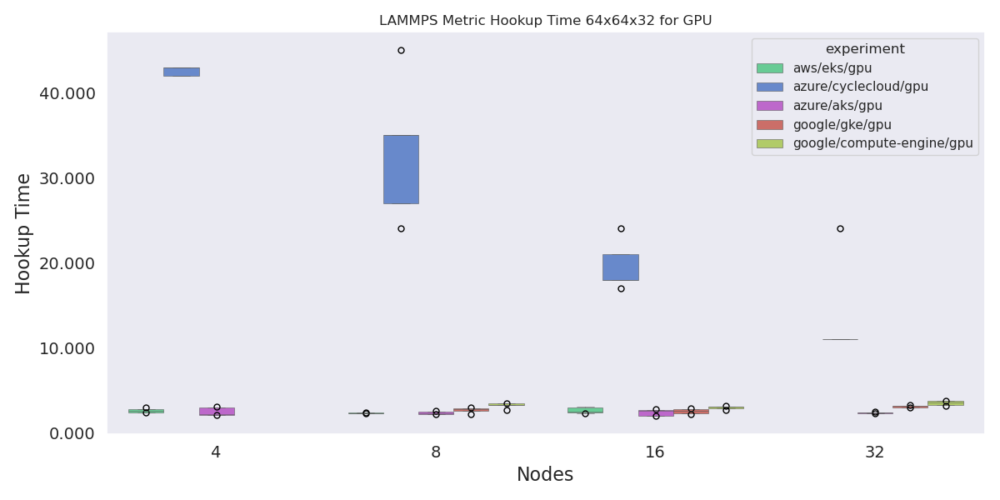

#### Hookup Time for CPU 64 x 64 x 32

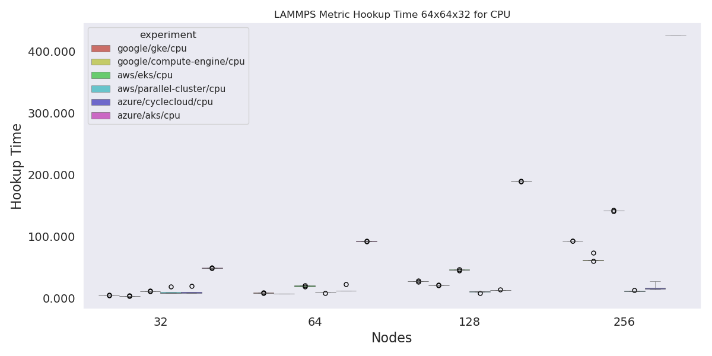

### Workload Manager Wrapper Seconds

> This is the wall time plus the hookup time.

#### Wrapper Time Seconds GPU 64 x 32 x 32

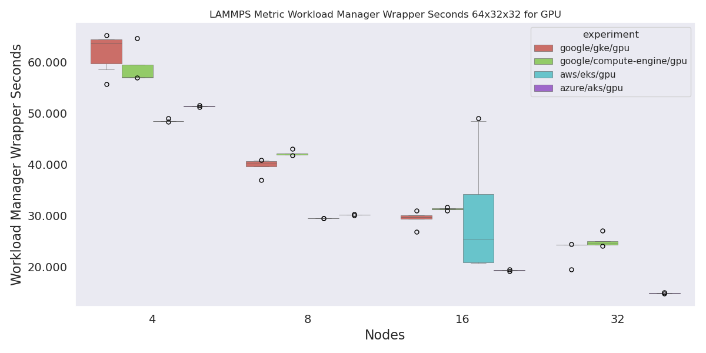

#### Wrapper Time Seconds GPU 64 x 64 x 32

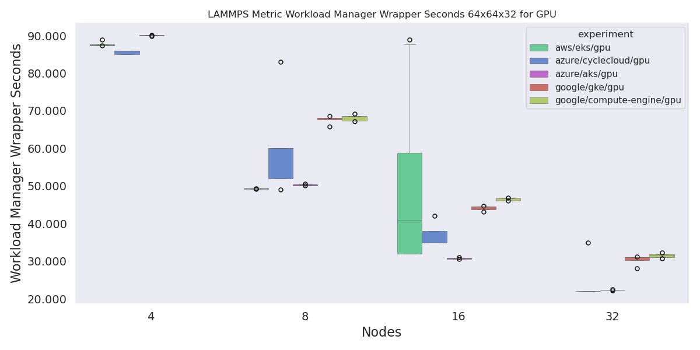

#### Wrapper Time Seconds CPU 64 x 64 x 32

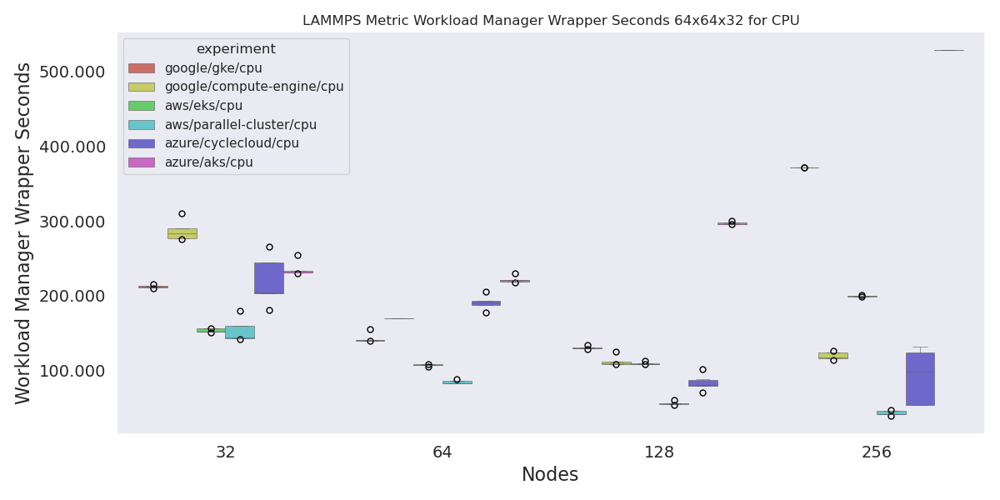

