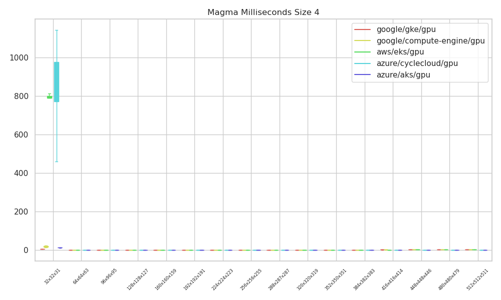
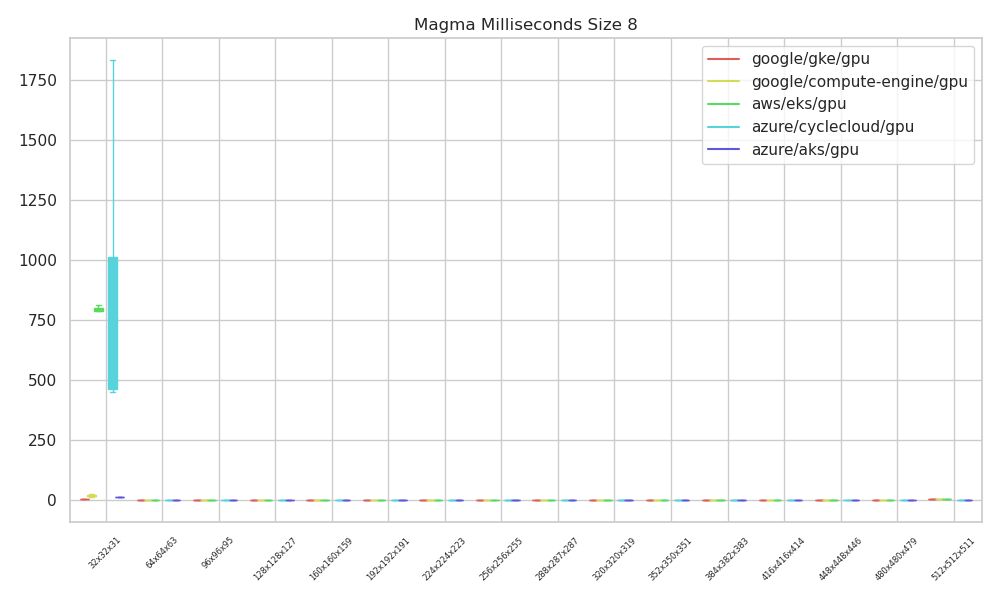
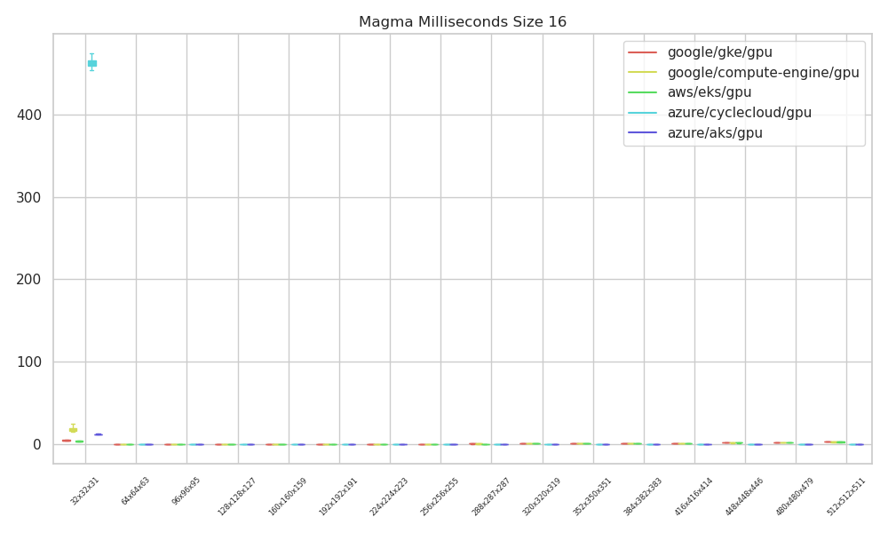
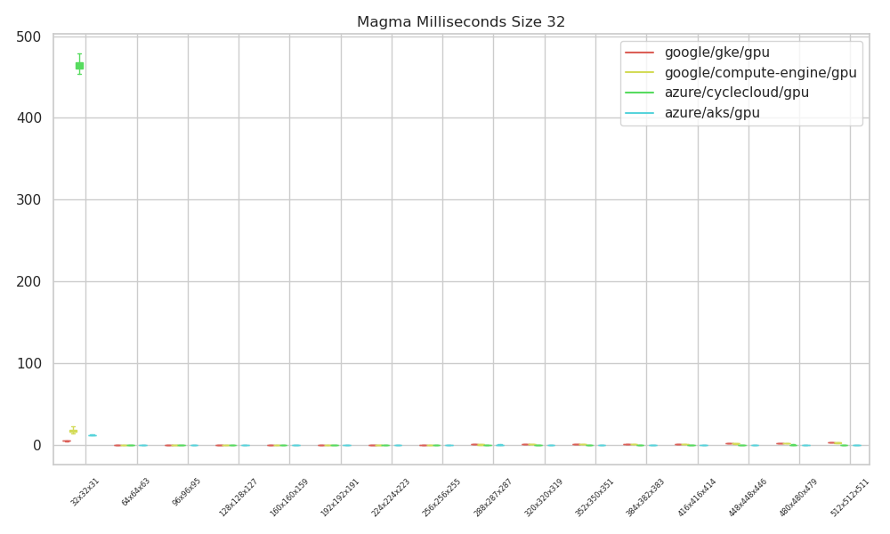

# Magma Analysis

For each run we are interested in parsing the vbatched result, which was run across environments with `--ngpus 1`. Although the runs were slightly different (on CycleCloud, etc the `CUDA_VISIBLE_DEVICES` was set to all of them, and on different Kubernetes environments it was set by the workload manager, meaning in practice we see device 1 for the latter and across devices for the first) we should still be able to compare the performance of individual GPUs. Given a result that looks like this:

```console
% transA = No transpose, transB = No transpose
%              max   max   max
% BatchCount     M     N     K   MAGMA Gflop/s (ms)   CPU Gflop/s (ms)   MAGMA error
%===================================================================================
         300    64    64    63     40.78 (   0.46)     ---   (  ---  )     ---
         300    32    32    31      0.00 ( 627.04)     ---   (  ---  )     ---
         300    64    64    63     61.24 (   0.31)     ---   (  ---  )     ---
         300    32    32    31      0.00 ( 628.92)     ---   (  ---  )     ---
         300    64    64    63     43.20 (   0.44)     ---   (  ---  )     ---
         300    32    32    31      0.00 ( 587.99)     ---   (  ---  )     ---
         300    64    64    63     57.02 (   0.33)     ---   (  ---  )     ---
```

We are going to plot the ms and Gflops/s separately. Each "chunk size" (the group of 3 including M, N, and K) will be assembled into a boxplot. While we shouldn't see variation across cluster sizes (the GPUs are not communicating) we will first plot them separately to see if there are any differences.

```bash
pip install -r requirements.txt
```

Then:

```bash
python 1-run-analysis.py
```

## Results

These are currently split up by size, because that gives somewhat more granularity. They don't need to be.

### Gflops/Second

This seems to be the metric of interest. Azure (for both AKS and CycleCloud) has higher values, and greater variability. But also - CycleCloud was run differently (across devices) and the others on just one device, and it's not clear what kind of impact that might have. It seems to start separation at the 224x problem size.

#### Size 4


#### Size 8


#### Size 16


#### Size 32

Note that we could not do any runs on EKS size 32, as we couldn't get the nodes.


### Milliseconds

I'm not actually sure what this is measuring - it seems to only spike up at the smallest "problem size" chunk, and only for a few environments. It's not clear if we removed these outliers if there would be meaningful differences down in the squashed data.

#### Size 4



#### Size 8



#### Size 16



#### Size 32



