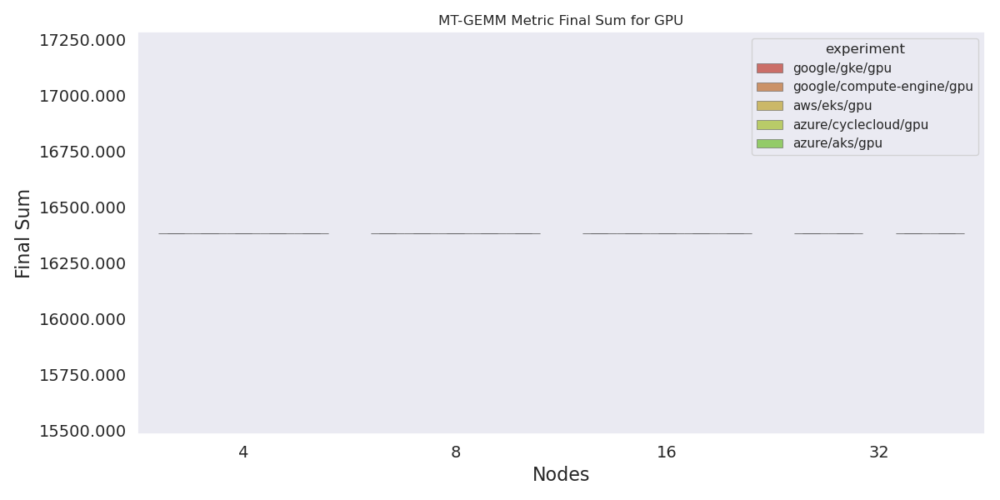
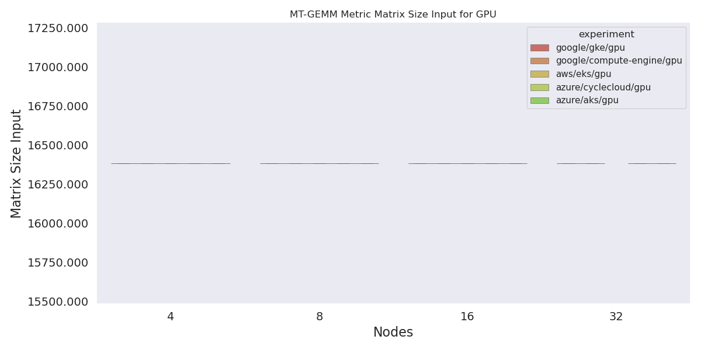
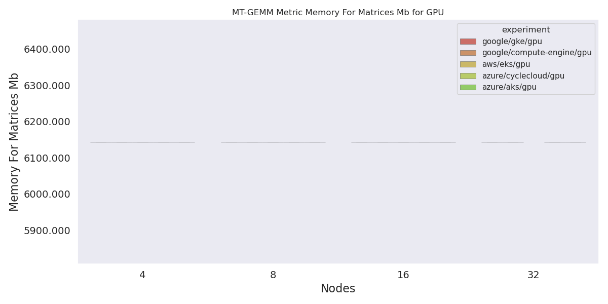
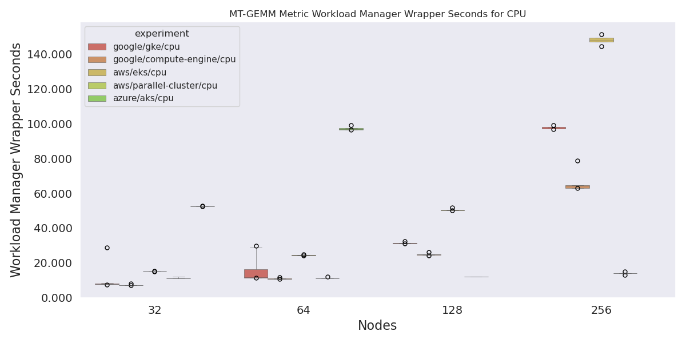
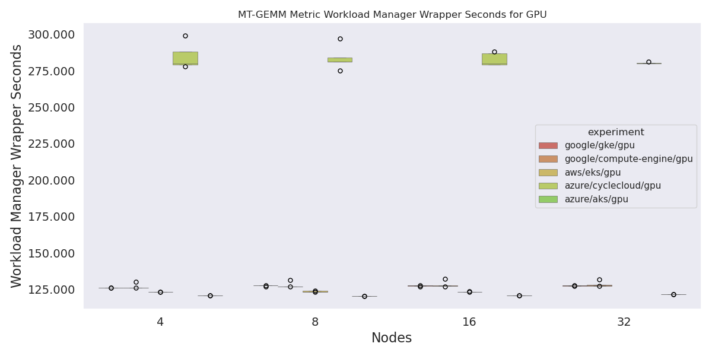
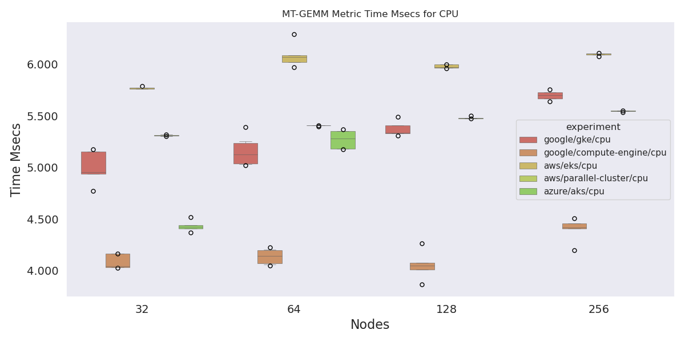

# MT-GEMM Analysis

This should be simple to parse, the entire result for CPU is:

```console
Performance= 335.11 GFlop/s, Time= 5.968 msec, Size= 2000000000 Ops
```

And for GPU:

```console
Matrix size input by command line: 16384
Repeat multiply 100 times.
Alpha =    1.000000
Beta  =    1.000000
Allocating Matrices...
Allocation complete, populating with values...
Performing multiplication...
Calculating matrix check...

===============================================================
Final Sum is:         16384.010000
 -> Solution check PASSED successfully.
Memory for Matrices:  6144.000000 MB
Multiply time:        112.881916 seconds
GFLOP/s rate:         498752.602665 GF/s
===============================================================
```

Plus the wrapper of the workload manager.

```bash
pip install -r requirements.txt
```

Then:

```bash
python 1-run-analysis.py
```

Note that the [1-run-analysis.py](1-run-analysis.py) has a listing of erroneous runs at the top that can be further investigated, most on CycleCloud. 

## Results

Note that the binaries for GPU/CPU were slightly different, so the results don't correspond.
I can't find any results for mt-gemm on CycleCloud CPU.

### Parameters

> A sanity check - alpha and beta, memory, matrix size, and the final sum should always be the same.

If they were different we ran different problems, etc.

#### Alpha GPU


#### Beta GPU


#### Final Sum



#### Matrix Size Input GPU



#### Memory GPU (GB)



### GFlops per Second GPU

Parallel cluster is not present because we couldn't run GPU there.


### Multiple Time GPU

That outlier is cyclecloud. I looked at the results, and they really are that high. CycleCloud, what you doin' bro?


### Performance GFlops Per Second for CPU

It seems that Google has the nicest CPU? I can't find any data for cyclecloud CPU.


### Wrapper time of Workload Manager (seconds) CPU

I can't explain this result, but at size 256 for AWS EKS Flux took longer to do the wrapped run. E.g., the done - shell.start is actually that many seconds.



### Wrapper time of Workload Manager (seconds) GPU

This is similar to the above, but CycleCloud GPU has (likely the hookup time included in the job) that makes it take a really long time. These would have been calculated from the timestamps in the job runs, so anything like errors or just slow hookup could cause that.



### Metric Size Ops for CPU

This is just a sanity check  - these all need to be the same to indicate we ran the same thing.


### Time in Msecs

Note that I did validate every unit was in msec. The range isn't very big (4 to 6) but within that small range, it does look like AWS EKS had slightly slower times.


