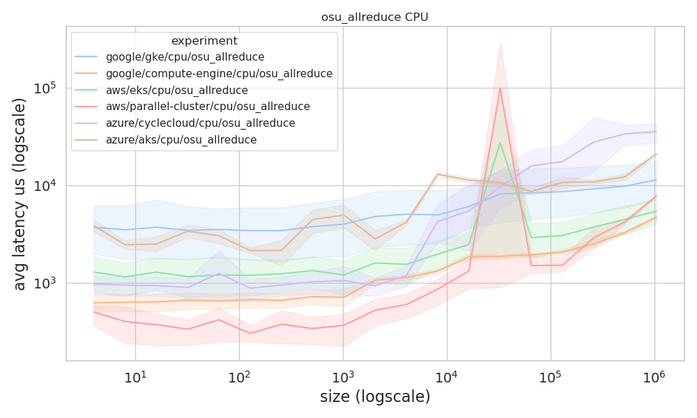
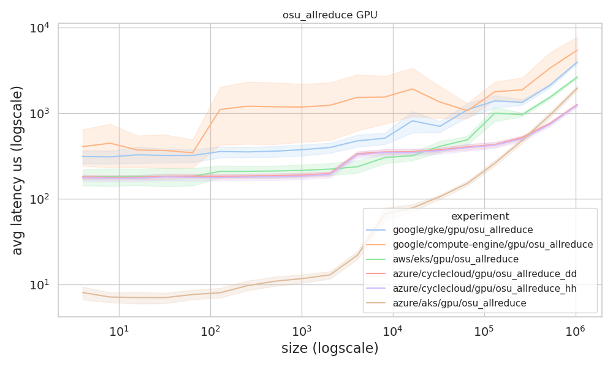
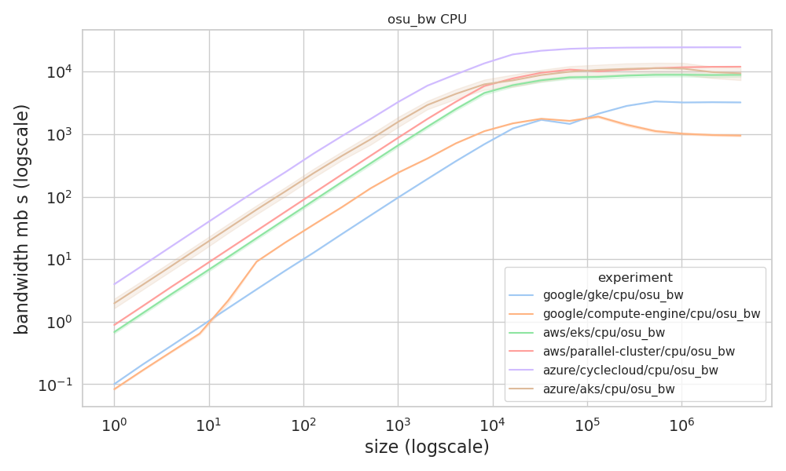
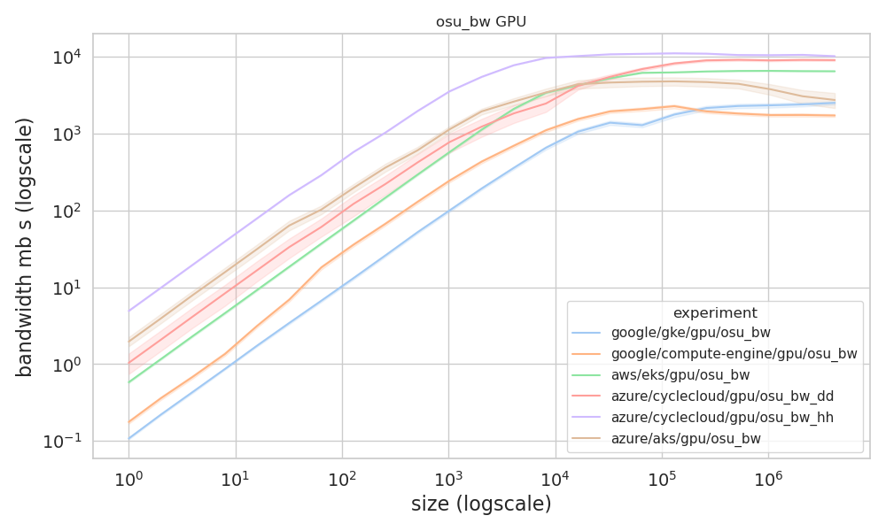
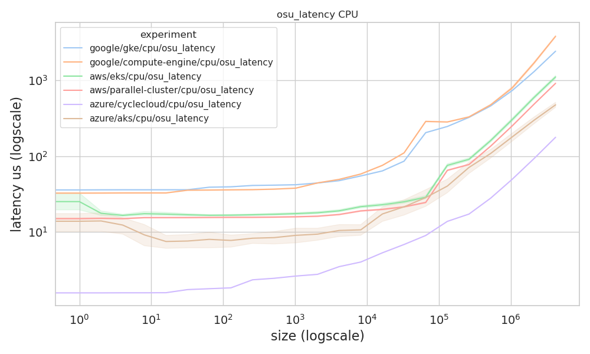
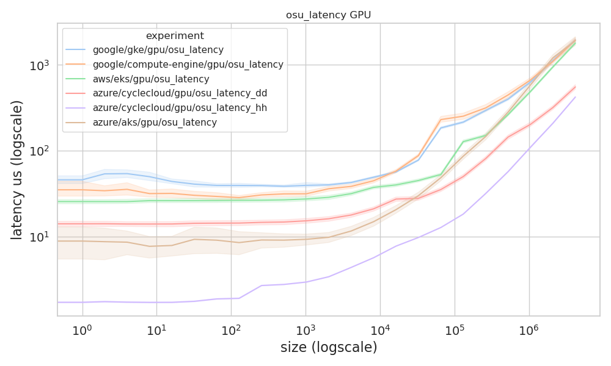

# OSU Benchmarks Analysis

This will generate plots for the OSU benchmarks. No surprise there.

```bash
pip install -r requirements.txt
```

Then:

```bash
python 1-run-analysis.py
```

This was immensely hard to parse, but I did my best. Nuances of the different runs are included below
and in the script comments.

## Results

### AllReduce

> Collections benchmark

#### AllReduce CPU



#### AllReduce GPU



### Bandwidth

> Point to point benchmark

#### Bandwidth CPU



#### Bandwidth GPU

Note that Google GKE was run without the cuda flags, didn't work. Those results do not use the GPU.



### Latency

> Point to point benchmark

#### Latency CPU



#### Latency GPU

Note that Google GKE was run without the cuda flags, didn't work. Those results do not use the GPU.


