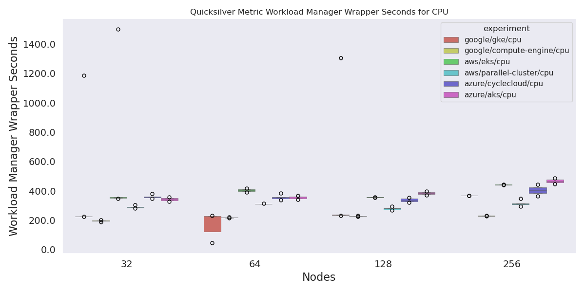
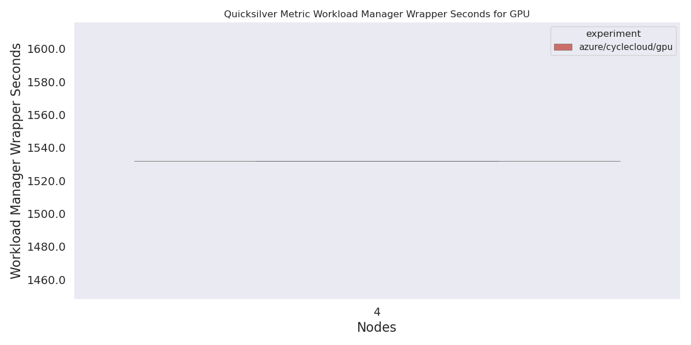

# Quicksilver Analysis

I just parse the workload manager wrapper time (for completed runs) and the figure of merit.

```bash
pip install -r requirements.txt
```

```bash
python 1-run-analysis.py
```

## Results

I think this shows us we only have completed GPU runs for Azure CycleCloud.





