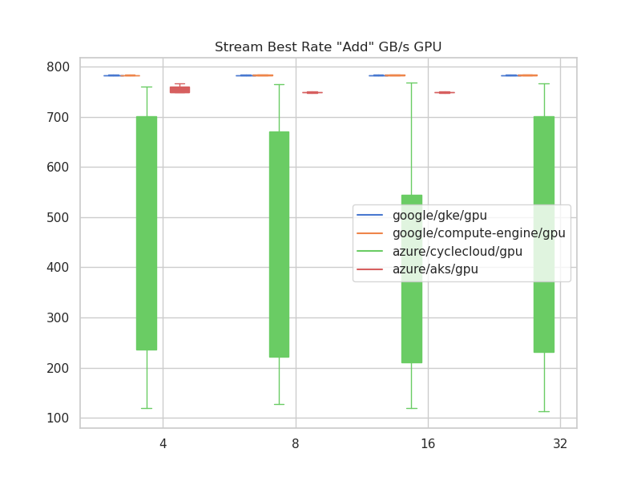
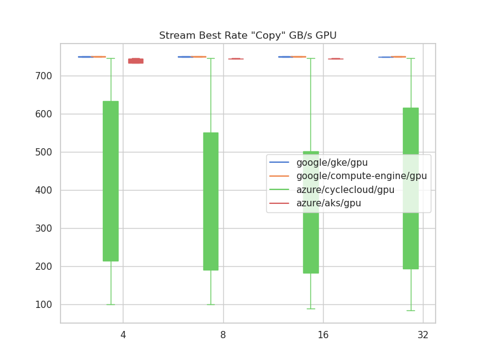
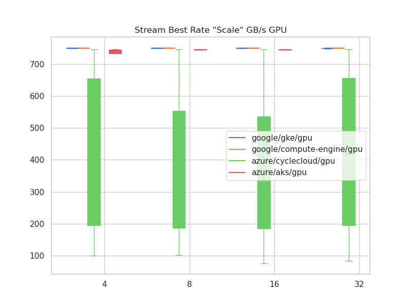

# Stream Analysis

Stream is used as a single benchmark, but it looks like for GPU we tried to run across nodes. But we possibly didn't know or decide to do this until after the early EKS GPU runs.

## Catalog

There are two ways to run stream - across nodes, or on single nodes.

**both**

- aws eks cpu: all nodes and single nodes

**single nodes**

- aws eks gpu: just single nodes
- aws parallel cluster cpu: just single nodes
- azure aks cpu: just single node
- azure cyclecloud cpu: just single node
- google compute-engine cpu: just single node
- google gke cpu: just single node

**all nodes**

- azure aks gpu:just all nodes
- azure cyclecloud gpu: just across nodes
- google compute-engine gpu: just all nodes
- google gke gpu: just acoss nodes

I looked at the data, and I actually think the way we ran it doesn't matter. It runs on each processor, so we can combine regardless of how many nodes it was run on.

```bash
pip install -r requirements.txt
```

Then:

```bash
python 1-run-analysis.py
```

## Results

I made these plots from scratch with matplotlib and spacing from raw vectors (it was too slow to assemble into pandas) - they came out great!

### Best Rate Add MB/s for CPU


### Best Rate Add MB/s for GPU



### Best Rate Copy MB/s for CPU


### Best Rate Copy MB/s for GPU



### Best Rate Scale MB/s for CPU


### Best Rate Scale MB/s for GPU



### Best Rate Triad MB/s for CPU


### Best Rate Triad MB/s for GPU


