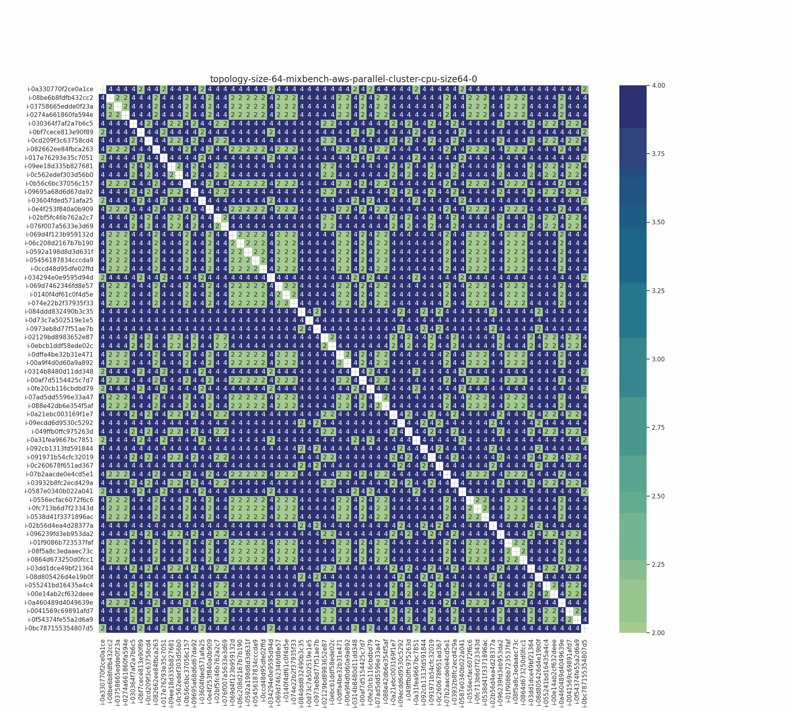
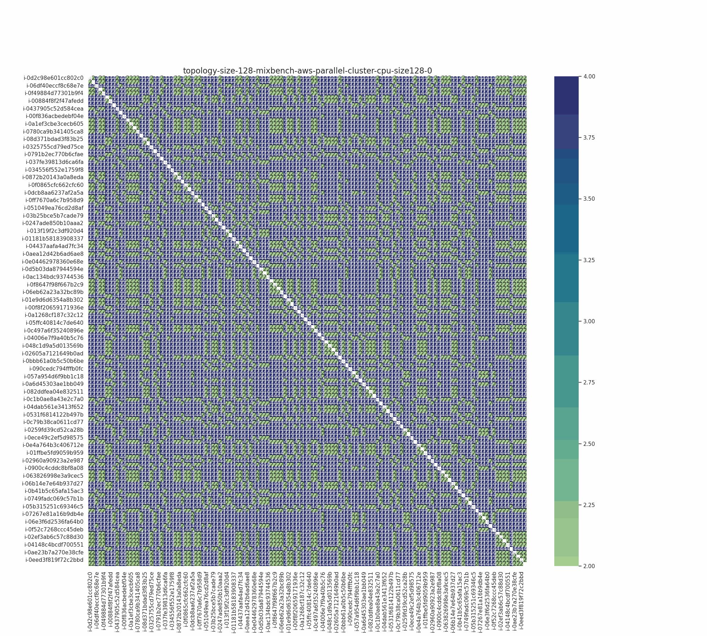
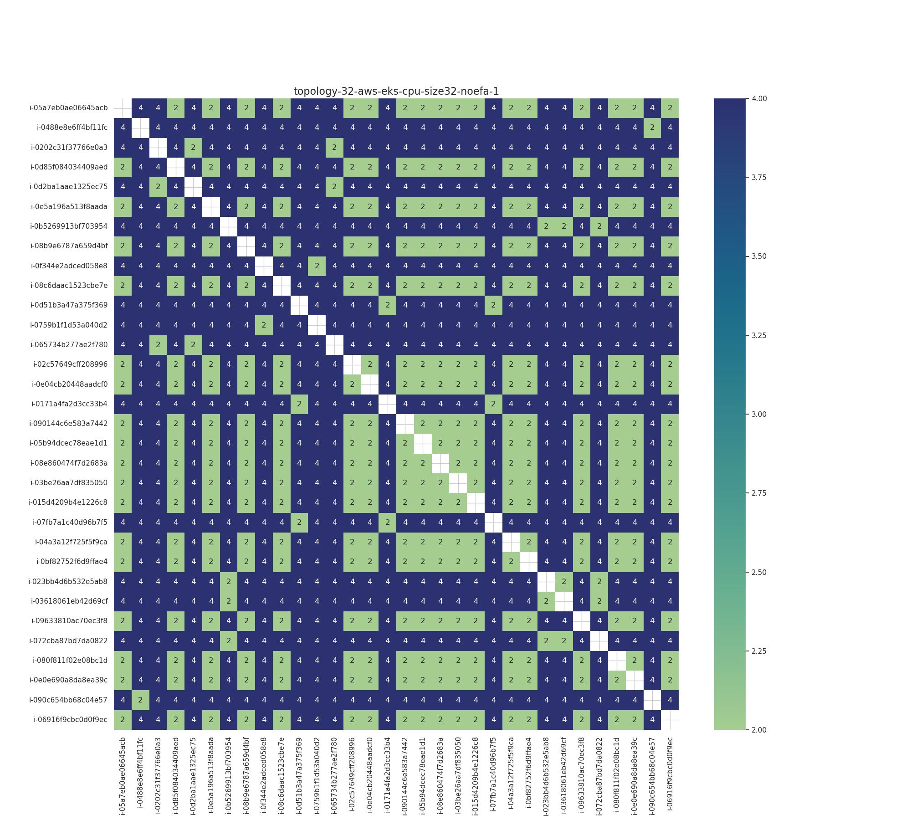
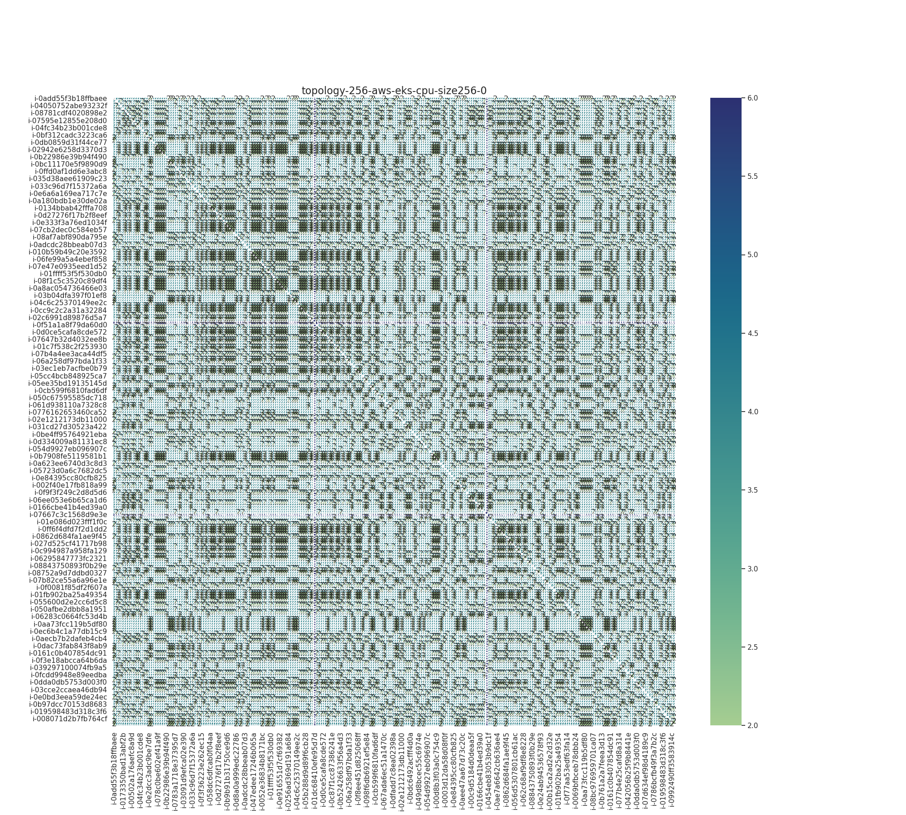

# Topology Analysis

This is to look at AWS topology. We don't have topology information for other clouds.

```bash
pip install -r requirements.txt
```

```bash
python 1-run-analysis.py
```

Aside from the images (png and gif animations) we have the following data:

- [data/creation_times.json](data/creation_times.json): a lookup of the file creation times, if we think the order is meaningful for plotting.
- [data/hop-counts-by-env_size.json](data/hop-counts-by-env_size.json): the hop counts by environment size.
- [data/hop-counts-by-size.json](data/hop-counts-by-size.json): the hop counts by size (squashing environment)
- [data/instance-uid-overlap-across-studies.json](data/instance-uid-overlap-across-studies.json): unique instance ids we saw across runs.

And the same directory has .csv files, each is the number of hops that are visualized in the plots.

## Results

This is really interesting! If you look down at the results (within a size) we can see that sometimes the clusters appear the same. Note that I didn't do any sorting of the uid names - they appear as they show up, which means the topology API result likely didn't change. What we can do is use the overlap data that I saved to assess a specific instance (that didn't go away) over time, which possibly has a changed position in the plot. For now, this is a good spot. Some observations first, followed by images (you can scroll through):

### Only GPU nodes had 6 hops

GPI only see 6 hops for the GPU clusters, which makes sense, because we know we were going across data centers. The rest are always 2 to 4 hops.

### Identical Instance IDs

It's interesting to scroll through (or down across) the images below and see that many are identical - these are likely on the same size, and for apps that were run close in time (on the same nodes). When I noticed this, I added a counter to see which instance names were duplicated, meaning we used them for more than one application run. You can see the counts in [data/instance-uid-overlap-across-studies.json](data/instance-uid-overlap-across-studies.json). There are instances that show up 2, 3, 8, and 9 times. I'm not sure what we can grep from this because it's not clear the time between the runs (we would need to calculate this) and then we would also need to know when we lost instances vs. needed to ask for new ones. We can be fairly sure if we lost instances and got new ones, even the same machines (under the hood) would have different instance ids. This overlap more likely represents efficient running on our part, because we ran (and didn't lose instances we had).

In the same thread, if we see the same pattern for hops, it's not guaranteed to be the same instance ID. We could easily lose an instance, get a new one for the same size, and have it be the same number of hops (and the plot appears the same despite different instance IDs).

### Topology label order

I didn't sort the topology labels - I added them to a set as they were found. I tried creating an animation anyway, not because it's accurate over time, but because it can (generally) show some change in topology. We could try creating a more accurate animation, but we'd want to integrate timestamp of the file generation, or something like that, or better consider the ordering of the labels.

### Hops (Skeleton) vs. Connectivity

When the cluster is the same, the hops obviously stay the same. This is the "skeleton" of connectivity and not the blood (signal) flowing through it. We would need to overlay OSU data to get a sense of actual connectivity. We don't have that for every data file, so the best we could do is to plot OSU latency with the corresponding topology we do have.

Overall, I think the most we can get out of this data is:

1. Comparing overall counts for number of hops between EKS and parallel cluster (albeit we have a lot more data for the latter).
2. Comparing how overall counts for hops changes over time.

I'm not sure we have enough data to say much more beyond that. Anyway - here they are!

## Images

Note that the only reason we have duplicates of any EKS sizes is because we had to redo studies, and each time I made a new cluster I use it as an opportunity to get topology data. Silver lining of mistakes, I suppose! For parallel cluster, since the nodes were actively changing, we have them for each application run.

## Parallel Cluster

#### Parallel Cluster Size 32


#### Parallel Cluster Size 64




#### Parallel Cluster Size 128




#### Parallel Cluster Size 256


### EKS

#### EKS GPU 16


#### EKS CPU 32





#### EKS CPU 64


#### EKS CPU 128


#### EKS CPU 256





